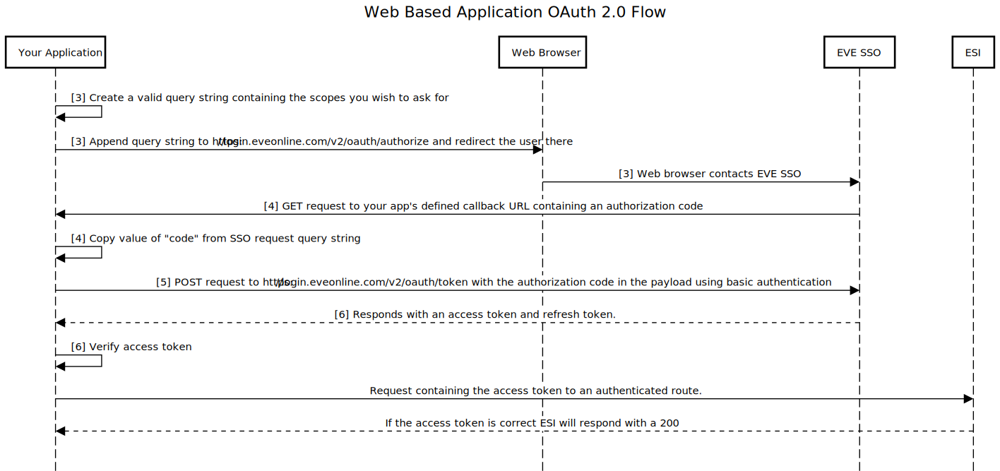

# OAuth 2.0 for Web Based Applications
*Note: This document assumes you have read the [basics of SSO authorization](sso_authorization_flow.md).*

This document will cover the implementation details you will need to know for your web based application to be able to complete the OAuth 2.0 flow with EVE's Single Sign On (SSO). This is required to access authenticated ESI routes.

## Overview of OAuth 2.0 flow for web based Applications

When doing the OAuth 2.0 flow with the EVE SSO, web based applications should be using [basic authentication](https://swagger.io/docs/specification/authentication/basic-authentication/).

Here is the OAuth 2.0 flow your web based application should be implementing:

1. [Create a new application](#TODO link) on the EVE SSO.

2. Store the `Client ID` and `Secret Key` assigned to your application somewhere that is accessible by your application. **The `Secret Key` in particular needs to be stored securely and should never be shared**.

3. Redirect your user to https://login.eveonline.com/v2/oauth/authorize/ with the following parameters in the [query string](https://en.wikipedia.org/wiki/Query_string).

    * `response_type=code` - This tells the EVE SSO what kind of response you are expecting from it, in this case you are letting it know you are starting the handshake for a authorization code.

    * `redirect_uri=<your application's defined callback>` - Replace all text between the `<>` with the full callback URL you defined for you application when [creating a new application](# TODO put link). **If you put in any other URL other than what is defined in your SSO application the EVE SSO will reject your request**.

    * `client_id=<your application's client ID>` - Replace all text between the `<>` with the client ID assigned to your application that you stored somewhere in step 2.

    * `scope=<A space delimited list of ESI scopes you would like to request permissions for>` - Replace all text between `<>` with a list of esi scopes split up by a single space that you would like to request permissions for (e.g. `scope=esi-characters.read_blueprints.v1 esi-corporations.read_contacts.v1`).

    * `state=<something-unique>` - Replace all text between the `<>` with a unique string of your choice. `state` is required by EVE's SSO to encourage extra security measures. A good explanation about how your application can be more secure with the use of the `state` parameter can be found [here](https://auth0.com/docs/protocols/oauth2/oauth-state).

    If you wanted access to a character's blueprints and your callback URL was `https://localhost/callback/` you would have a URL that looks something like this (anything surrounded by `<>` should be replaced by you): `https://login.eveonline.com/v2/oauth/authorize/?response_type=code&redirect_uri=https://localhost/callback/&client_id=<your-client-id>&scope=esi-characters.read_blueprints.v1&state=<unique-string>`.

4. The EVE SSO will send a GET request to your application's defined callback URL containing the query parameters `code` and `state` that looks like this (anything between `<>` is not literal): `https://<your-callback-url>/?code=<super-secret-code>&state=<unique-state-string-from-you>`.

    Your application needs to lift the value of the `code` query parameter from the URL so that it can be used in the next step. This authorization code is a one time use only token that has a lifetime of 5 minutes. If you do not respond within 5 minutes you will have to start over at step 1 again.

5. Now that your application has the authorization code, it needs to send a POST request to `https://login.eveonline.com/v2/oauth/token` with a payload containing the authorization code using [Basic authentication](https://swagger.io/docs/specification/authentication/basic-authentication/) where your application's client ID will be the user and your secret key will be the password. Here is a little more detail on how to craft this request:

    * Create a JSON payload that like this (replace anything between `<>`):

            {
                "grant_type": "authorization_code",
                "code": <authorization code from callback URL>
            }

    * Create a URL safe base64 encoded string where the contents before encoding are your application's client ID, followed by a `:`, followed by your application's secret key (e.g. `<client_id>:<secret_key>`).

    * You will need to send the following HTTP headers (replace anything between `<>`):
        * `Authorization: <base64 encoded credentials>`
        * `Content-Type: application/x-www-form-urlencoded`
        * `Host: login.eveonline.com`

    * Finally, send a POST request to `https://login.eveonline.com/v2/oauth/token` with your JSON payload and the headers from the last step.

6. If the previous step was done correctly, the EVE SSO will respond with a JSON payload containing an access token (which is a [Json Web Token](https://jwt.io/introduction/)) and a refresh token that looks like this (anything between `<>` is not literal and will be different for you):

        {
            "access_token": <JWT token>,
            "expires_in": 1199,
            "token_type": "Bearer",
            "refresh_token": <base64 encoded string>
        }

    For added security, before trusting the access_token and refresh_token, you should [validate the access token](validating_eve_jwt.md) to make sure it has not been tampered with in transit from the SSO to your application.

    Once validated, your application will need to store both the access token and refresh token from this payload. **Store the refresh token somewhere secure and never share it**.

    *Note on security: the access token should also be stored securely but if it were to get leaked it can only be used for as long as is left of its 20 minute lifetime. If your refresh token gets leaked it can only be invalidated by you, the application developer, by revoking it [here](#TODO link). **If you know your refresh token has been leaked you must revoke it**.*

The following diagram is a visual representation of the steps above. Any number between brackets (`[]`) is a reference to a step number in the list above:

If any of this is confusing, there is a [code example](../examples/python/sso/esi_oauth_web.py) available in Python that you can run locally to see this flow in action.

## Further reading
You can continue by reading about [how to send an authorized request to ESI](sending_esi_auth_request.md) or you can read about [how to get a new access token using your refresh token](refreshing_access_tokens.md).
