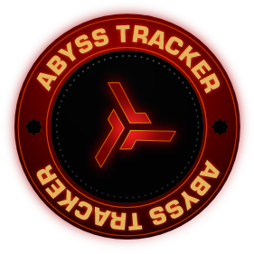

---
search:
  exclude: true

title: Abyss Tracker
type: service
description: A loot tracker specifically for the Abyss Runners in EVE Online. Share your runs and analyze them. Its connected to EVE Workbench for the fits.
maintainer:
  name: EVE Workbench Team
  github: EVE-Workbench
---

# Abyss Tracker

The Abyss Tracker is a "killboard" for your Abyssal Deadspace runs - you can save your exact loot saved, aggregated and compared with others. You can also browse and share fits with other players.

The website is maintained by the team behind [EVE Workbench](https://eveworkbench.com).

- [:octicons-browser-16: __Website__](https://abysstracker.com){ .esi-card-link }
- [:simple-discord: __Discord__](https://discord.gg/dA3kHUv){ .esi-card-link }
- [:octicons-mark-github-16: __GitHub__](https://github.com/EVE-Workbench){ .esi-card-link }

## Features

- **Record runs**: Add your Abyss runs to Abyss Tracker and compare with others
- **Browse Fits**: Browse through the most popular - or - newest Abyssal fits. (Fits are also visible on EVE Workbench)
- **Loot table**: See the drop changes of the items in the Abyssal Deadspace
- **Leaderboards**: Compete with other Abyss Runners to get on top of our leaderboards
- **Weather & Tier overview**: Statistics over the different weathers and tiers of the Abyssal Deadspace

