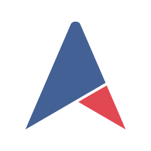

---
search:
  exclude: true

title: Alliance Auth
type: service
description: An auth system for EVE Online to help in-game organizations manage online service access.
maintainer:
  name: Alliance Auth Team
  gitlab: allianceauth
---

# Alliance Auth 

- [:simple-discord: __Discord__](https://discord.gg/fjnHAmk){ .esi-card-link }
- [:simple-gitlab: __GitLab__](https://gitlab.com/allianceauth/allianceauth){ .esi-card-link }
- [:octicons-browser-16: __Documentation__](https://allianceauth.readthedocs.io/){ .esi-card-link }

## Description

Alliance Auth (AA) is a web site that helps Eve Online organizations efficiently manage access to applications and services.

## Features

- Automatically grants or revokes user access to external services (e.g. Discord, Mumble) and web apps (e.g. SRP requests) based on the user's current membership to [in-game organizations](https://allianceauth.readthedocs.io/en/latest/features/core/states/) and [groups](https://allianceauth.readthedocs.io/en/latest/features/core/groups/)

- Provides a central web site where users can directly access web apps (e.g. SRP requests, Fleet Schedule) and manage their access to external services and groups.

- Includes a set of connectors (called ["services"](https://allianceauth.readthedocs.io/en/latest/features/services/)) for integrating access management with many popular external applications / services like Discord, Mumble, Teamspeak 3, SMF and others

- Includes a set of web [apps](https://allianceauth.readthedocs.io/en/latest/features/apps/) which add many useful functions, e.g.: fleet schedule, timer board, SRP request management, fleet activity tracker

- Can be easily extended with additional services and apps. Many are provided by the community and can be found here: [Community Creations](https://gitlab.com/allianceauth/community-creations)

- English :flag_gb:, Chinese :flag_cn:, German :flag_de:, Spanish :flag_es:, Korean :flag_kr:, Russian :flag_ru:, Italian :flag_it:, French :flag_fr:, Japanese :flag_jp: and Ukrainian :flag_ua: Localization

For further details about AA - including an installation guide and a full list of included services and plugin apps - please see the [official documentation](https://allianceauth.rtfd.io).

# Alliance Auth Community Creations

- Over 100+ Applications from 30+ Developers

<https://gitlab.com/allianceauth/community-creations>