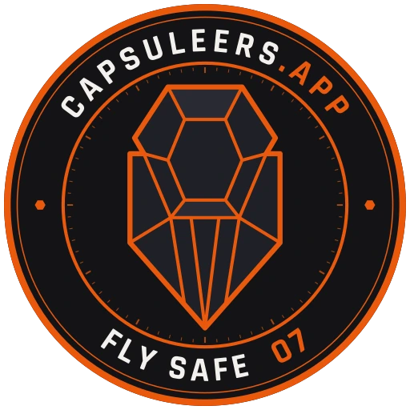

---
search:
  exclude: true

title: Capsuleers.app
type: service
description: Community hub and gameplay toolbox for EVE Online - news and player-written articles, public profiles, a live killboard, live and sovereignty maps, fitting, industry and fleet tools - plus two companion desktop apps for Local and D-Scan intel, one with a local AI assistant.
maintainer:
  name: TremalJack
  github: WilliamFalci
---

# Capsuleers.app

Capsuleers.app is a community site and gameplay toolbox for EVE Online, in English and
Italian. It combines the things a pilot reads — news, player-written articles, public
profiles — with the things a pilot uses before and after undocking: maps, a killboard,
fitting, industry planning, fleet tooling.

Character data is reached through the official EVE SSO and ESI. **OAuth tokens never
leave the server**: every authenticated call is made by a server-side proxy that verifies
the character belongs to the session and carries the required scope.

- [:octicons-browser-16: __Website__](https://capsuleers.app){ .esi-card-link }
- [:simple-discord: __Discord__](https://discord.com/invite/hdbtSFBGD3){ .esi-card-link }
- [:octicons-download-16: __Capsuleers.Intel__](https://github.com/WilliamFalci/capsuleers.intel/releases/latest){ .esi-card-link }
- [:octicons-download-16: __Capsuleers.IA__](https://github.com/WilliamFalci/capsuleers.ia/releases/latest){ .esi-card-link }

## Maps and intel

- **Live regional map** — the region drawn the way the in-game 2D map draws it, with kills
  per system, sovereignty logos, incursion and insurgency markers, active sovereignty
  campaigns, and gate camps marked on the gate itself rather than on the system. Your
  tracked characters and, when you are the fleet boss, your fleet members appear on it.
- **Sovereignty map** — the whole of known space, with alliance influence, the stargate
  network, staging systems and a campaign layer.
- **Sovereignty timers** — every campaign ESI advertises, running or scheduled, with EVE
  time, local time and a live countdown, filterable and watchable per alliance.
- **Killboard** — a searchable feed over a 90-day killmail archive, with filters for
  pilot, corporation, alliance, ship, constellation, region and security band, plus a gate
  camp radar and a hunting lens over where an entity actually operates.
- **Pilot intel** — paste a Local roster or a D-Scan and get a per-pilot read: danger
  rating, playstyle, frequent wingmates, recent hulls.

## Tools

- **Fitting** — a Pyfa-parity fitting calculator for ships and Upwell structures, with a
  public fit library. The engine is open source and published separately as
  [`eve-fit-engine`](https://www.npmjs.com/package/eve-fit-engine).
- **Industry planner** — a full build tree for any product: material and time with ME/TE,
  rig coverage per family, build-or-buy per line, blueprints and skills required, job
  scheduling across several characters, and a shopping list netted against what is already
  in the right hangar.
- **Asset matrix** — your whole inventory by system, searchable, valued per item.
- **Jump range, jump planner and route finder** — capital ranges and routes, stargate
  routes with Thera and Turnur transits, incursion and insurgency warnings along the way.
- **Fleet tooling** — fleet tracker with per-pilot participation, fleet and battle reports,
  a shareable waitlist with eligibility checks, and cross-fleet participation analysis.
- **Paragon Hub** — the public SKINR design market, browsable and filterable, with a 3D
  preview of each design on the real hull.
- **Encyclopedia, faction warfare, incursions, market prices** and an incursion ISK/hour
  calculator.

## Desktop apps

Two companion desktop apps for Windows and Linux bring the site's intel to the moment you
need it, in game. Both use the capsuleers.app API as their backend, and both can turn a
scan into a 24-hour share link on the site. Source is MIT.

- **[Capsuleers.Intel](https://github.com/WilliamFalci/capsuleers.intel)** — the
  lightweight one. Copy your Local roster or a D-Scan and get a per-pilot read (danger
  rating, playstyle, frequent wingmates, recent hulls) or the hostile fleet broken down by
  ship class, computed offline from a bundled SDE snapshot. An opt-in clipboard watcher
  picks up a scan the moment you copy it, so it works while you play fullscreen. A download
  of tens of megabytes, nothing to set up.
- **[Capsuleers.IA](https://github.com/WilliamFalci/capsuleers.ia)** — everything Intel
  does, plus a local AI assistant. A language model runs **on your machine** over a
  retrieval index of EVE knowledge and answers with the sources it used, in English or
  Italian. It also analyses EFT fits offline with
  [`eve-fit-engine`](https://www.npmjs.com/package/eve-fit-engine). Installers come per GPU
  backend (CUDA for NVIDIA, Vulkan for AMD and Intel); the models and the index are
  downloaded once on first launch, so it needs gigabytes of disk and a GPU with enough
  VRAM for the chat model you pick.

Pick Intel if you only want the intel; pick IA if you also want the assistant.

## Streaming

Three OBS browser-source overlays: a live kill feed, a live ship card for one or more
pilots, and an in-game ISK donation list.

## Notes

Hulls are rendered with [ccpwgl2](https://github.com/cppctamber/ccpwgl2), the community
WebGL implementation of the game's own renderer, so a ship is drawn from the client's own
resources rather than from a static image.

A public [status page](https://capsuleers.app/status) declares what is working, both for
the five services run here and for the thirteen upstream ones the site depends on.

Capsuleers.app is a fan-made site. It is free, it is not affiliated with or endorsed by
the rights holder, and EVE Online data and materials are used under the EVE Online
Developer License Agreement. The full intellectual property notice is on the
[Terms of Service](https://capsuleers.app/terms-of-service) page.
