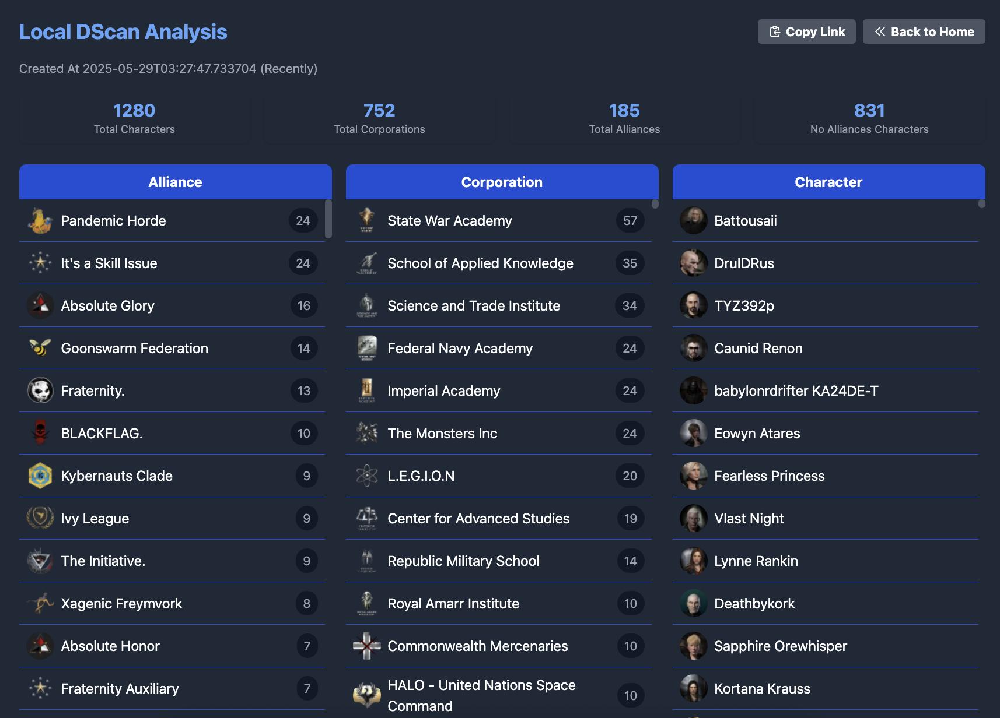
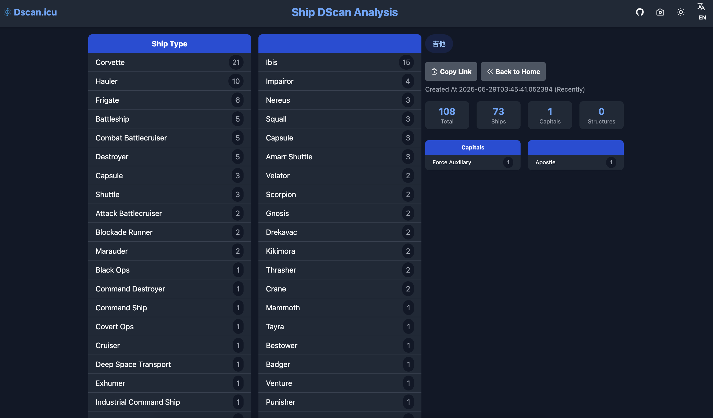

---
search:
  exclude: true

title: Dscan ICU
type: service
description: DSCAN ICU is a tool for analyzing and sharing D-Scan results in EVE Online, supporting multiple languages.
maintainer:
  name: zifox666 Garveen
  github: zifox666
---

# DSCAN-ICU

DSCAN-ICU is a powerful tool designed for EVE Online players to analyze, visualize, and share directional scan (D-Scan) results. It helps pilots quickly interpret scan data, identify threats, and coordinate with their fleet. The tool is accessible via web and supports internationalization (i18n) for a global user base.

Page languages:

- [中文](index_cn.md)
- English

- [:octicons-browser-16: __Website__](https://dscan.icu){ .esi-card-link }
- [:octicons-mark-github-16: __GitHub__](https://github.com/zifox666/eve-dscan-tool){ .esi-card-link }

## Features

- **D-Scan Parsing**: Quickly parse and analyze D-Scan results.
- **Visualization**: Display scan data in an easy-to-read format.
- **Sharing**: Share scan results with your fleet or community.
- **i18n Support**: Fully supports multiple languages for international users.
- **Data Export**: Export scan data for further analysis.

## Submit

## Local Dscan

## Ship Dscan

More features and improvements are planned. Contributions are welcome!