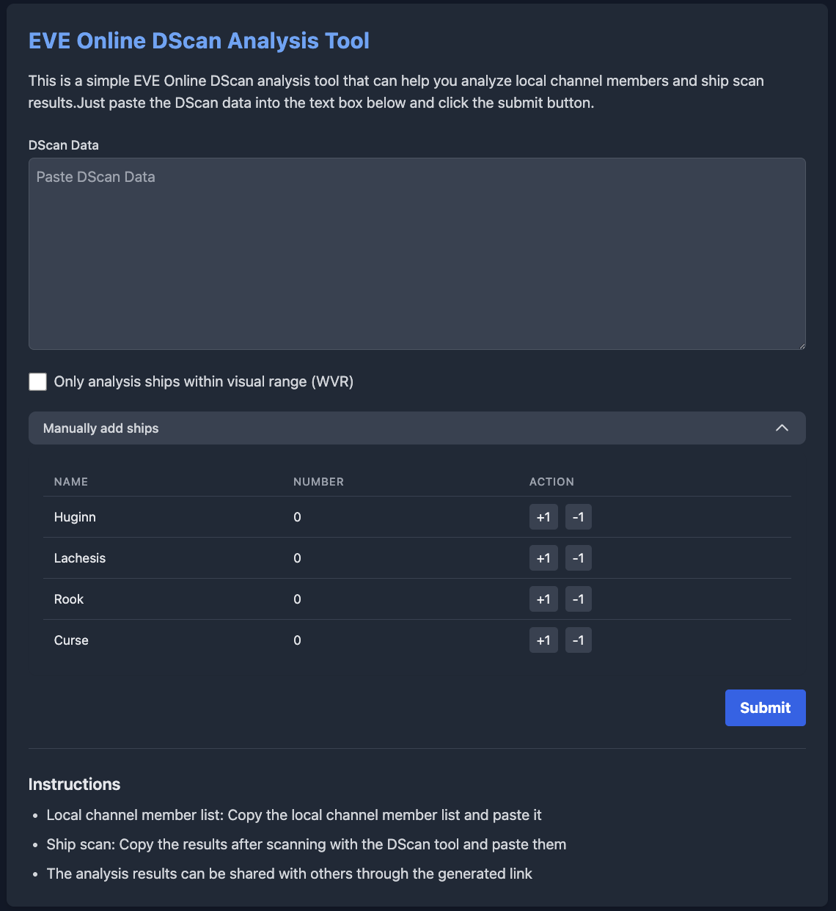

---
search:
  exclude: true

title: Dscan ICU
type: service
description: DSCAN ICU 是一个用于分析和分享 EVE Online D-Scan 结果的工具，支持多语言。
maintainer:
  name: zifox666 Garveen
  github: zifox666
---

# Dscan ICU

Dscan ICU 是为 EVE Online 玩家设计的强大工具，用于分析、可视化和分享定向扫描（D-Scan）结果。它帮助飞行员快速解读扫描数据，识别威胁，并与舰队协同作战。该工具可通过网页访问，并支持国际化（i18n），适合全球用户。

页面语言：

- 中文
- [English](index.md)

- [:octicons-browser-16: __网站__](https://dscan.icu){ .esi-card-link }
- [:octicons-mark-github-16: __GitHub__](https://github.com/zifox666/eve-dscan-tool){ .esi-card-link }

## 功能

- **D-Scan 解析**：快速解析和分析 D-Scan 结果
- **可视化**：以易读的格式展示扫描数据
- **分享**：与舰队或社区分享扫描结果
- **多语言支持**：完全支持多语言，方便国际用户
- **数据导出**：导出扫描数据以便进一步分析

## 提交

## 本地 Dscan

## 舰船 Dscan

更多功能和改进正在计划中，欢迎贡献！