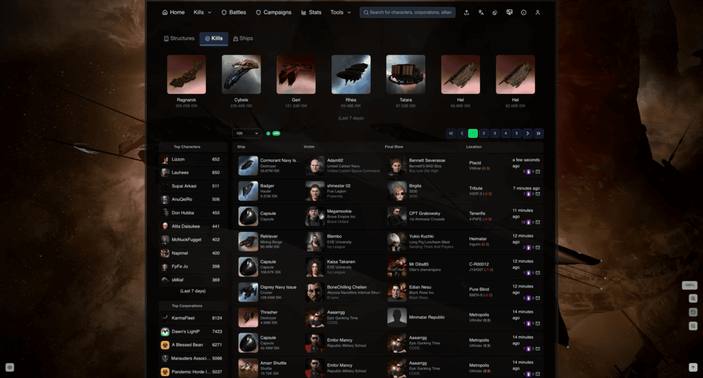
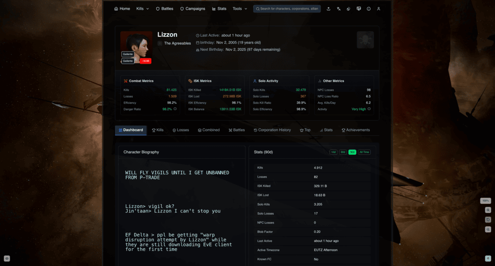
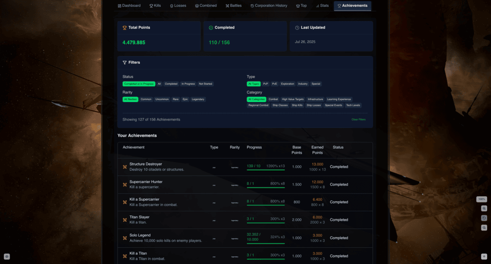
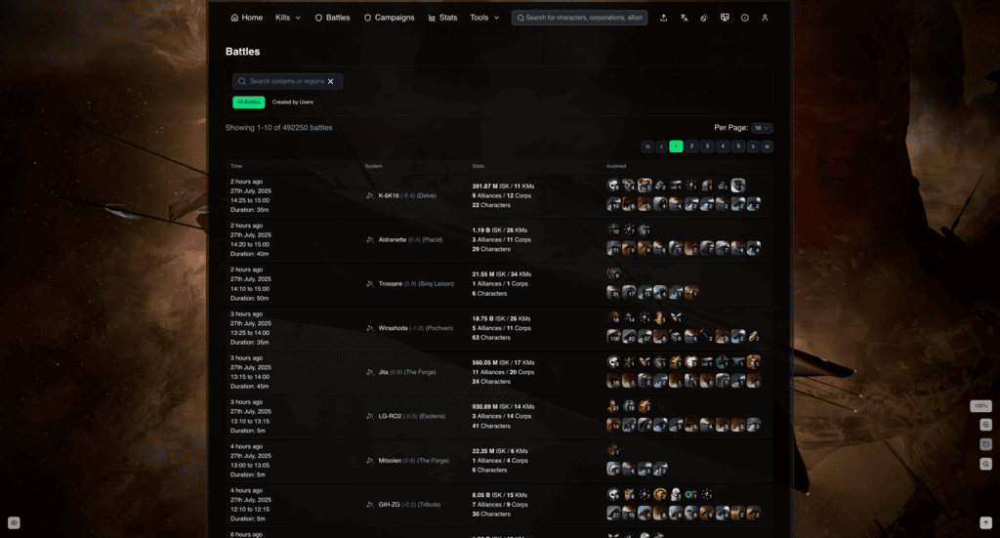
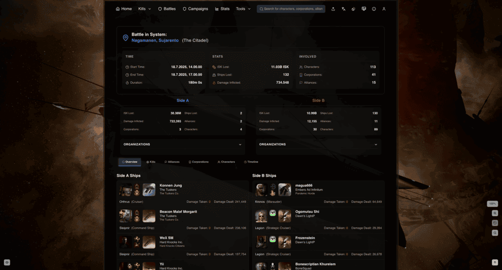
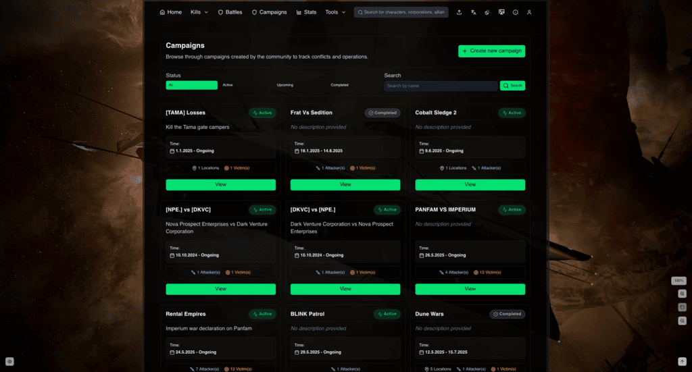
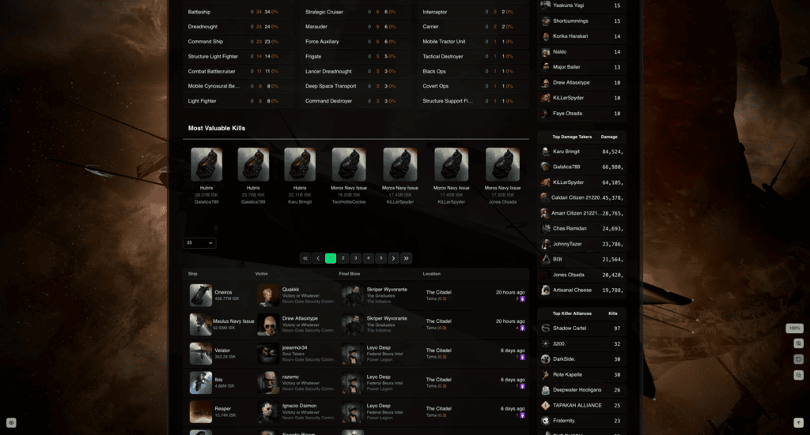
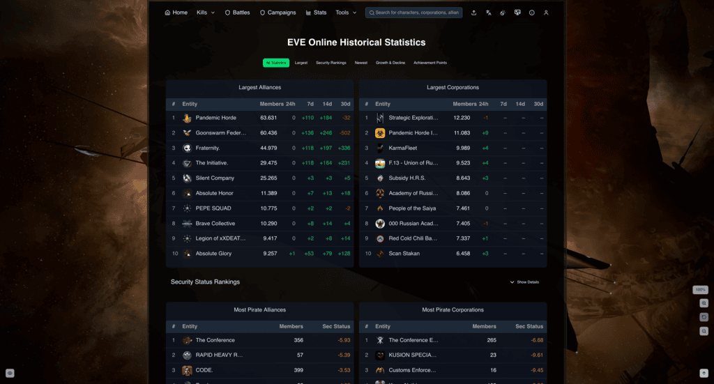

---
search:
  exclude: true

title: EVE-KILL.com
type: service
description: EVE-KILL.com is a killboard for EVE-Online, allowing players to track and share their in-game combat activities.
maintainer:
  name: Karbowiak
  github: karbowiak
---

# EVE-KILL.com

<figure markdown="span" style="width: 250px; margin: auto;">
  
</figure>

- [:simple-discord: __Discord__](https://discord.gg/R9gZRc4Jtn){ .esi-card-link }
- [:simple-github: __GitHub__](https://github.com/EVE-KILL/Thessia){ .esi-card-link }
- [:octicons-book-16: __Documentation__](https://github.com/EVE-KILL/Thessia/tree/main/docs/){ .esi-card-link }

## Overview

**EVE-KILL.com** is a dynamic killboard for EVE Online that empowers players to track, analyze, and share their combat activities. Offering real-time data, detailed analytics, and comprehensive statistics, it serves as a hub for the EVE community to gain insights into PVP and PVE engagements across New Eden.

## Resources & Navigation

| Resource | Description |
|----------|-------------|
| [Home Page](https://eve-kill.com) | Main landing page |
| [FAQ Page](https://eve-kill.com/faq) | Frequently Asked Questions |
| [Status](https://eve-kill.com/status) | System status (queue details, database stats) |
| [Statistics](https://eve-kill.com/stats) | Top alliances and corporations statistics |
| [Campaigns](https://eve-kill.com/campaigns) | Warfare operations and campaign tracking |
| [Battles](https://eve-kill.com/battles) | Detailed battle reports and analytics |
| [Advanced Search](https://eve-kill.com/advancedsearch) | Powerful search across all game entities |
| [Metenox](https://eve-kill.com/metenox) | Metenox moon goo data |

## Key Features

### Killboard & Real-Time Tracking

- Instant killmail updates via websocket
- Extensive killmail database with detailed combat records
- Filters by security status (HighSec, LowSec, NullSec, W-Space, Abyssal, Pochven), ship class, and value thresholds
- Activity-based filters including solo kills, NPC kills, citadel kills, and ship tech tiers (T1/T2/T3)

### Analytics & Statistics

- Historical growth and performance metrics for characters, corporations, and alliances
- Top lists for players, organizations, ships, and locations

### Battle & Campaign Tools

- Automated battle detection and detailed engagement reports
- Battle Generator for custom reports by system and timeframe
- Campaign Creator for tracking warfare operations with public/private options
- Advanced filtering and time-based tracking for campaigns

### Advanced Search & Scanning Tools

- Powerful query builder for precise searches across entities and items
- D-Scan Analyzer for directional scanner data
- Local Scan Tool to analyze local chat participants

### Profiles & Community Features

- Detailed profiles for characters, corporations and alliances
- Character achievements highlighting individual combat milestones
- EVE SSO integration for secure login
- Commenting system on killmails

### Technical & Data Coverage

- Translated to all languages supported by EVE Online
- Comprehensive REST API with Swagger/Scalar documentation
- Mobile-responsive design

## Screenshots

### Frontpage

### Character Dashboard

### Character Achievements

### Battles Index

### Battles Dashboard

### Campaigns Index

### Campaigns Dashboard

### Stats

