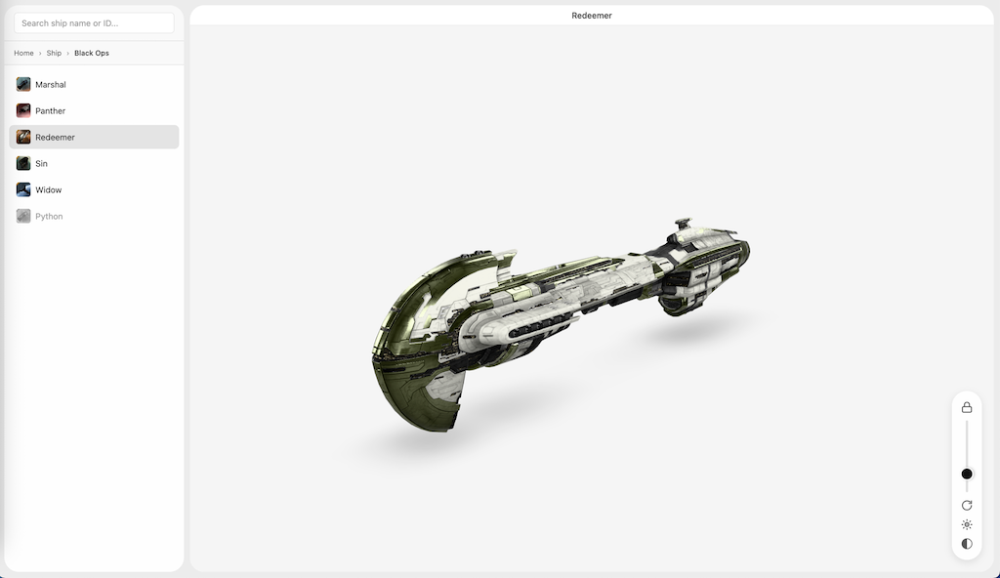

---
search:
  exclude: true

title: EVE Model Gallery
type: service
description: A website for viewing in-game models from EVE Online
maintainer:
  name: EstamelGG
  github: EstamelGG
---

# EVE Model Gallery

A website for viewing in-game models from EVE Online.
This website includes models of most common ships and structures from the game, presented in GLB format.

Note: Properties such as color schemes, metallicness, and roughness are manually reconstructed and do not represent the actual in-game values.

- [:octicons-browser-16: __Website__](https://estamelgg.github.io/EVE_Model_Gallery/){ .esi-card-link }
- [:octicons-mark-github-16: __Repository__](https://github.com/EstamelGG/EVE_Model_Gallery){ .esi-card-link }

