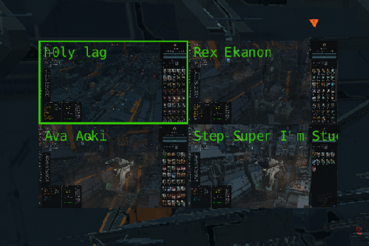
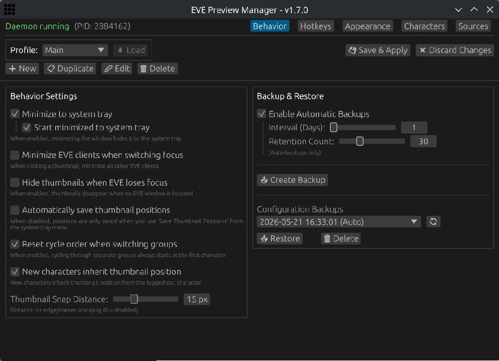

---
search:
  exclude: true

title: EVE Preview Manager
type: service
description: Native Linux desktop utility for EVE Online multiboxing with real-time client previews, profiles, and hotkeys.
maintainer:
  name: h0lylag
  github: h0lylag
---

# EVE Preview Manager

EVE Preview Manager is a native Linux desktop utility to aid players in managing their multiboxing setups. It provides live thumbnail previews, configurable hotkeys, and profile-based settings for switching between characters and client groups.

  
  
  
  
  
  

- [:octicons-browser-16: __Website__](https://epm.sh){ .esi-card-link }
- [:octicons-mark-github-16: __GitHub__](https://github.com/h0lylag/EVE-Preview-Manager){ .esi-card-link }
- [:simple-discord: __Discord__](https://discord.gg/MxdW5NCjwV){ .esi-card-link }

## Features

- Real-time thumbnail previews of all EVE client windows
- Per-character and cycle group hotkeys with configurable key bindings
- Customizable thumbnail size, opacity, fonts, colors, and borders
- Profile-based configuration for managing multiple setups
- One-click character import for cycle groups
- Optional support for cycling logged-off clients, auto-minimizing inactive windows, inheriting positions for new characters, and disabling thumbnails entirely

## Screenshots

## Installation

EVE Preview Manager is available from Flathub, the Arch User Repository, FlakeHub, and GitHub.

[Flathub](https://flathub.org/apps/com.evepreview.manager) | [AUR](https://aur.archlinux.org/packages/eve-preview-manager) | [FlakeHub](https://flakehub.com/flake/h0lylag/EVE-Preview-Manager) | [Releases](https://github.com/h0lylag/EVE-Preview-Manager/releases)
