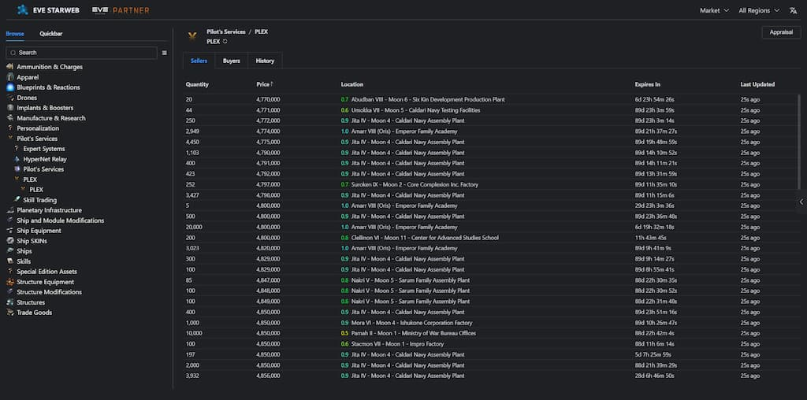
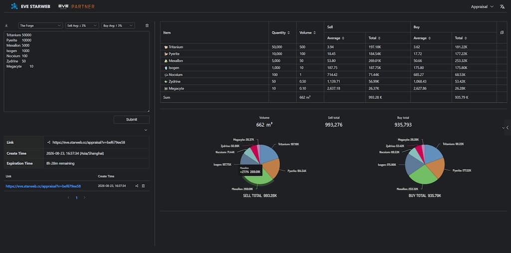
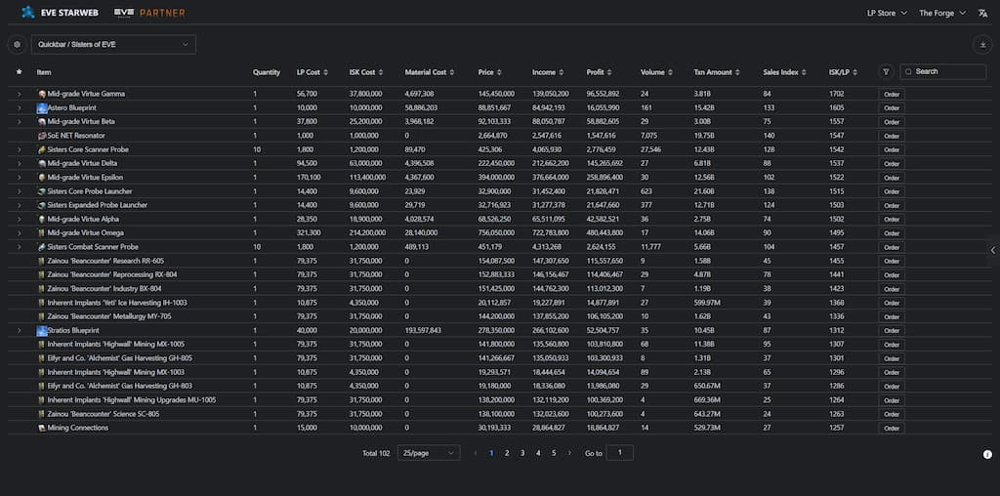
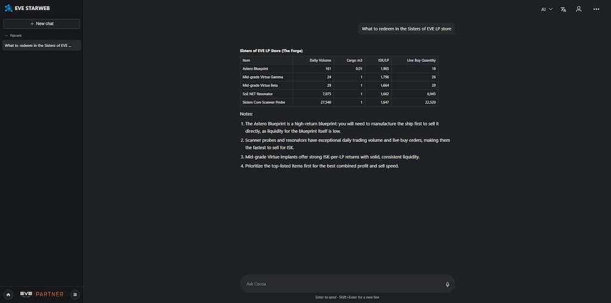

---
search:
  exclude: true

title: EVE STARWEB
type: service
description: Provides market, LP store, appraisal, and AI tools for EVE Online, available in multiple languages.
maintainer:
  name: alexdongsh
  github: alexdongsh
---

# EVE STARWEB

EVE STARWEB is a web tool for EVE Online **market**, **LP store**, **appraisal**, and **AI**, available in multiple languages.

- [:octicons-browser-16: __Website__](https://eve.starweb.cc){ .esi-card-link }

  
  
  
  

## Features

- **Market**: Live buy and sell orders, region browsing, price history, and jump counts after login.
- **Appraisal**: Paste an item list to see buy and sell totals. You can share the result with a link.
- **LP Store**: Browse corporation LP offers, compare ISK/LP, and open orders or stats for an item.
- **AI**: Ask AI for prices, LP recommendations, appraisals, and navigation. Logged-in pilots can set destination or add a waypoint.
