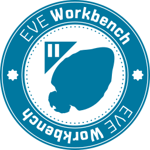

---
search:
  exclude: true

title: EVE Workbench
type: service
description: A web based tool for the EVE community, allowing players to browse the market, create haul routes and browse & share fittings.
maintainer:
  name: EVE Workbench Team
  github: EVE-Workbench
---

# EVE Workbench

EVE Workbench (EWB) is a website with multiple tools for EVE Online. The main tools are our **Fit browser**, **Market Browser**, **Appraisal tool** and more.

- [:octicons-browser-16: __Website__](https://eveworkbench.com){ .esi-card-link }
- [:simple-discord: __Discord__](https://discord.gg/dA3kHUv){ .esi-card-link }
- [:octicons-mark-github-16: __GitHub__](https://github.com/EVE-Workbench){ .esi-card-link }

## Features

- **Fit Browser**: Browse through fits uploaded by the EVE Community or share your own created fits
- **Market Browser**: A easy way to check for prices all around New Eden.
- **Appraisal Tool**: Want to know how much your space junk is worth? Use our Appraisal Tool.
- **Refinery**: Mined a lot of ore - or - salvaged a lot of ships? Use our Refinery Tool too see what the possible outcome is based on skill and structure traits.
- **Trade Tool**: Aspire to be a hauler? Our Trade Tool can give you possible good trades between two systems.
- **Fleet Browser**: Do you fly alot of (NPSI) fleets? Use our Fleet Composer and Browser to let your members see what fits they could fly for that said fleet. (Also used by Tooters Fleet every saturday)

!!! note "Big update coming soon"
    
    At this moment the team of EVE Workbench is busy with a massive rebuild of the entire website. Introducing new features and better UX.
    Thats also why we've uploaded the new logo to this page.

    With the update some features will change a bit in a good way, but the new site can already be visited at our Preview website. 

Already want to experience [EVE Workbench 2 (Preview)](https://preview.eveworkbench.com)?

