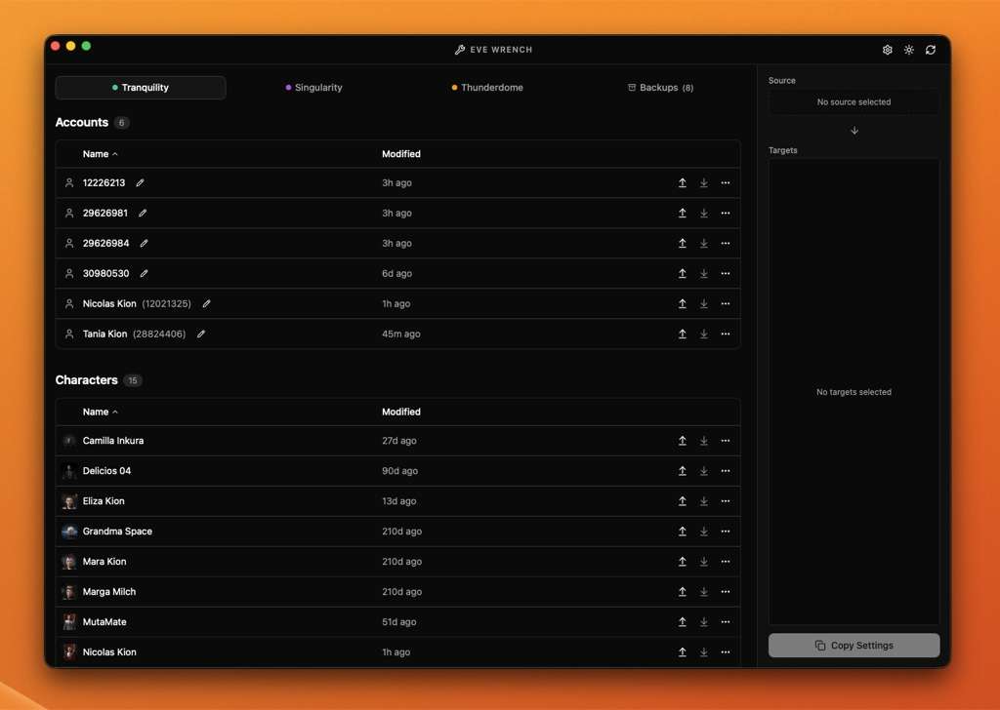
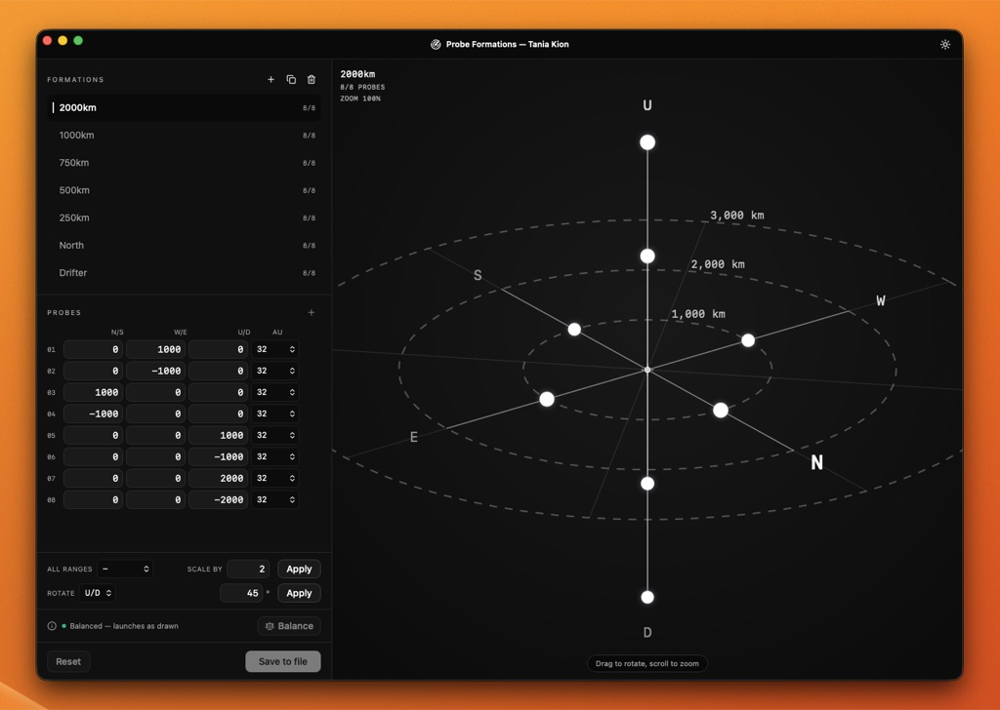

---
search:
  exclude: true

title: EVE Wrench
type: service
description: A settings manager for EVE Online. Back up, restore, sync, and edit your account and character settings, safely.
maintainer:
  name: Tim Kunze
  github: TimKunze96
---

# EVE Wrench

{ width="128" }

EVE stores account and character settings (overview, window layout, probe formations, keybinds) in binary files on disk, so copying a setup to a new alt usually means shuffling `.dat` files by hand. EVE Wrench makes this a safe, visual workflow. It runs on Windows, macOS, and Linux and supports all servers: Tranquility, Singularity, Thunderdome, and Serenity.

- [:simple-github: **GitHub**](https://github.com/eve-wrench/eve-wrench-app){ .esi-card-link }
- [:octicons-download-16: **Downloads**](https://github.com/eve-wrench/eve-wrench-app/releases){ .esi-card-link }

## Settings sync

Pick a source account or character, pick one or more targets, and copy in one click. Each settings group has a checkbox, so you can push your overview, window layout, and suppressed dialogs everywhere while leaving a character's module slots or search history untouched. Account settings only copy to accounts and character settings only to characters, and every target is backed up before changes.

*Accounts and characters on Tranquility, with the sync panel on the right.*

## Backups

Create named, timestamped backups of any account or character. Restore a backup to its origin, or apply it to any compatible target. Backups are stored inside EVE's own settings folders, so they are easy to find and survive a reinstall of the app.

## Probe formation editor

A 3D editor for custom probe scanner formations, with presets (Pinpoint, Drifter, directional stacks), per-probe coordinates in km, and the valid scan ranges from 0.25 to 32 AU. Formations can be scaled, rotated, duplicated, and balanced with a counterweight probe so they launch centered on your ship. Saves are lossless, backed up first, and need no client restart.

*Editing a formation in the 3D preview.*

## Import and export

Export all settings, backups, and aliases as a single archive. On import, each file is classified as new, unchanged, or conflicting, and only the conflicts you confirm are overwritten, with a backup made first.

## Identification

Characters are shown with their portrait and corporation from ESI. Accounts, which EVE identifies only by number, can be given custom aliases.

## Extras

EVE Wrench can edit settings the client does not expose, such as *Always Show Bracket Text*, supports custom settings folder locations, and ships with light and dark themes in English and Chinese.
