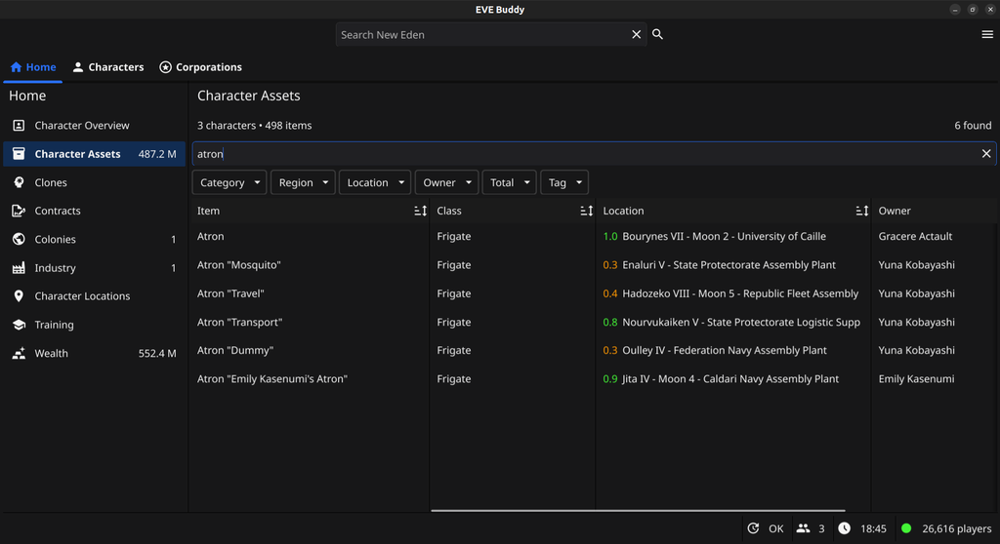
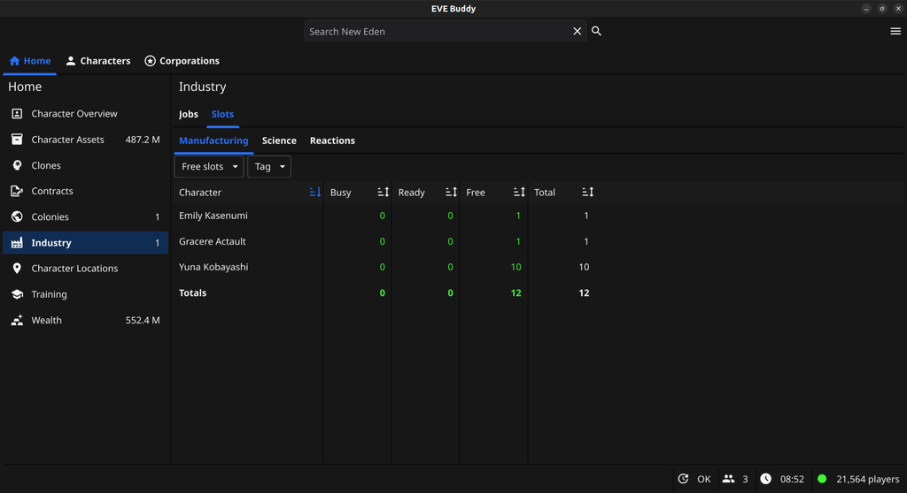
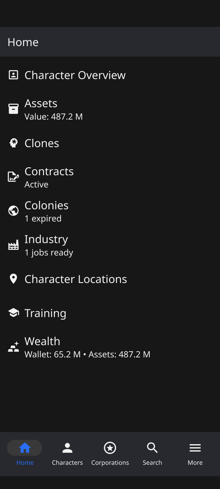
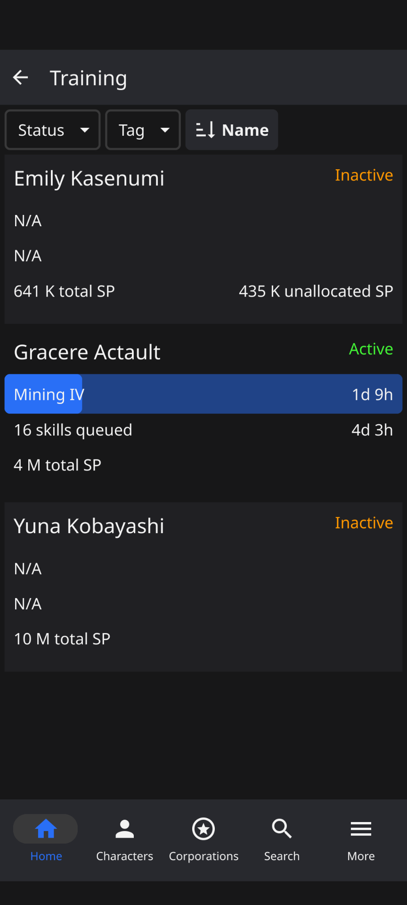

---
search:
  exclude: true

title: EVE Buddy
type: service
description: EVE Buddy is a companion app for Eve Online players available on Windows, macOS, Linux and Android.
maintainer:
  name: Erik Kalkoken
  github: ErikKalkoken
---

# EVE Buddy

EVE Buddy is a multi-platform companion app for Eve Online players. It is available on Windows, macOS, Linux and Android.

- [:octicons-mark-github-16: __GitHub__](https://github.com/ErikKalkoken/evebuddy){ .esi-card-link }
- [:simple-discord: __Discord__](https://discord.gg/tVSCQEVJnJ){ .esi-card-link }

## Features

The following is an overview of of EVE Buddy's key features. All features are available for both desktop and mobile:

- __Character monitor__: Check current information about each of your characters, e.g. inspect the training queue of a character or browse it's assets.
- __Corporation monitor__: Check current information about each of your corporations: e.g. check corporation wallets or see all current members.
- __Overviews__: Keep track of and get unique insights about all your characters and corporations with consolidated views, e.g. find assets across of your characters or see which character has manufacturing slots available.
- __Notifications__: Get notified on your desktop or mobile about new EVE communications and other important updates, e.g. a structure was attacked or a training queue became empty.
- __New Eden search__: Search live on the game server, similar to in-game search bar, e.g. search for characters, corporations solar systems.
- __Information windows__: Show additional information for most objects on screen, similar to in-game information windows, e.g. the sender of a mail
- __Mail client__: Send and receive EVE mails for all your characters
- __Run in Background__: The app can run in the background and continue to notify you while you are doing something else (e.g. play Eve Online)
- __Theming__: Configurable color theme, e.g. light and dark.

## Screenshots

This section contains screenshots from the desktop and mobile version for a selection of features.

### Desktop

Screenshots from the desktop version (Linux Ubuntu).

#### Asset search across all characters

#### Industry slots

### Mobile

Screenshots from the mobile version (Google Pixel).

#### Home screen

### Training overview

## More information

For more information please visit our website on Github or please join our Discord server if you have any questions.
