---
search:
  exclude: true

title: EVECompanion
type: service
description: Monitor your characters, plan your capital jump routes and follow events in the EVE Online universe with this iOS companion app.
maintainer:
  name: Jonas Schlabertz
  github: Schlabbi
---

# EVECompanion iOS App

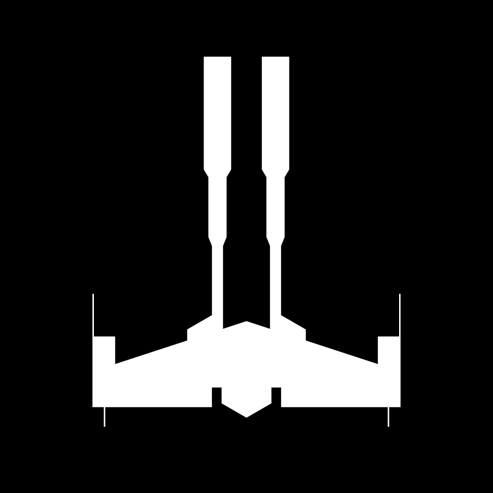

Monitor your characters, plan your capital jump routes and follow events in the EVE Online universe with this iOS companion app.

- [:octicons-device-mobile-16: **App Store**](https://apps.apple.com/app/evecompanion/id6504098870){ .esi-card-link }
- [:octicons-mark-github-16: **GitHub**](https://github.com/EVECompanion){ .esi-card-link }

# Features

- **Character Tracking**: Monitor your characters' progress and status.
- **Skill Queues**: Keep an eye on your skill training.
- **Wallet Management**: Track your ISK and financial transactions.
- **Mail Access**: Read your EVE Mails on the go.
- **Contract Overview**: Stay updated on your contracts.
- **Jump Clones**: Track your jump clones and their locations.
- **Industry Jobs**: Stay informed about your industry jobs.
- **Planetary Colonies**: Easily track all your planetary industry colonies.
- **Assets**: Browse your assets.
- **Sovereignty Campaigns**: Monitor upcoming and active sovereignty timers.
- **Capital Navigation**: Plan and calculate jump routes on-device for quick and efficient capital ship travel.
- **Item Database**: Explore the item database and view detailed information on individual items.
- **Skill Notifications**: Get push notifications for completed skills and empty skill queue warnings.
- **Demo Mode**: Explore all features without logging in.

## Character Monitoring

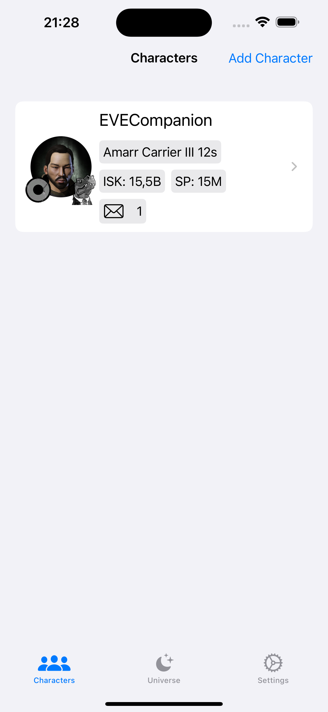
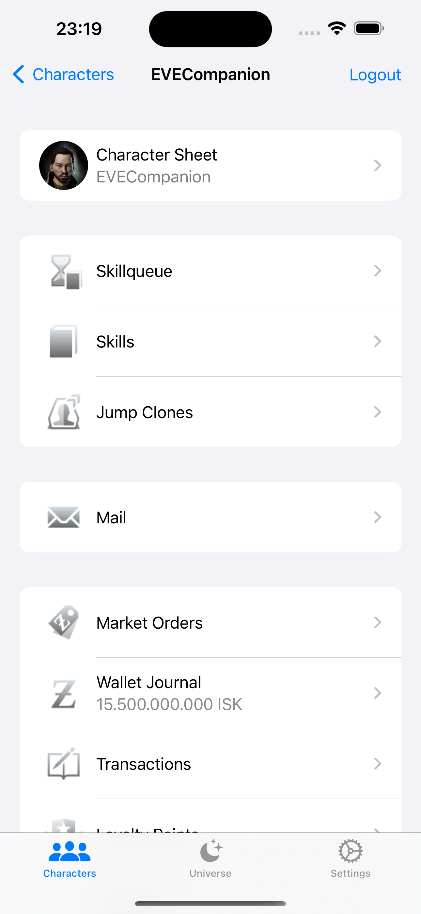
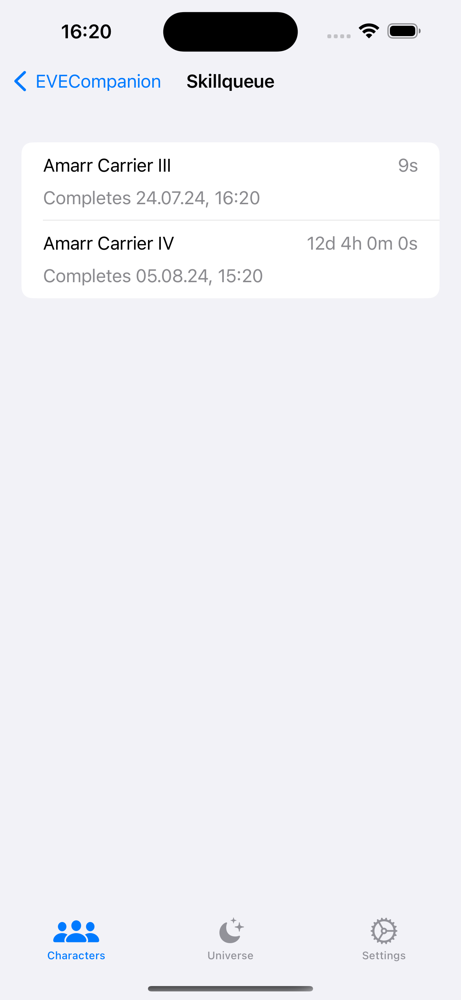
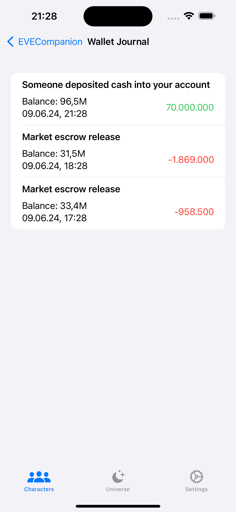
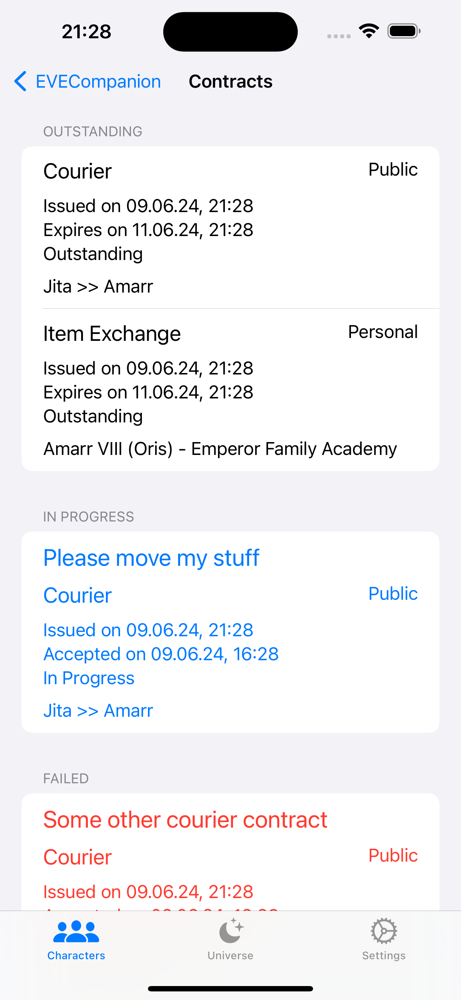

## Plan your capital jump routes

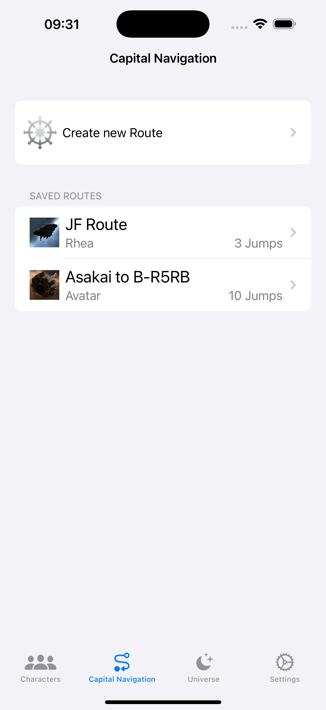
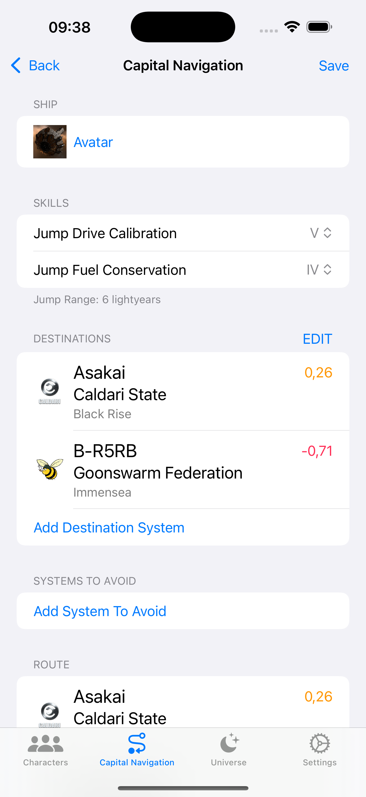
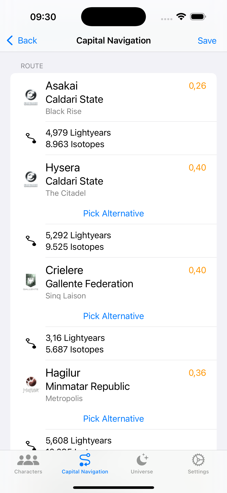

## Observe incursions and sov timers

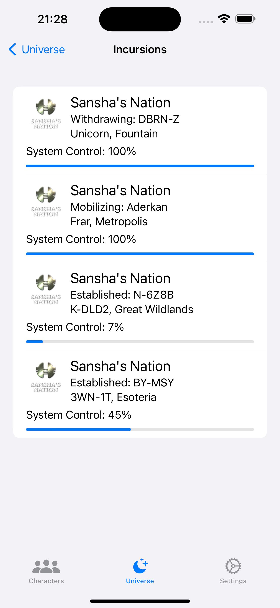
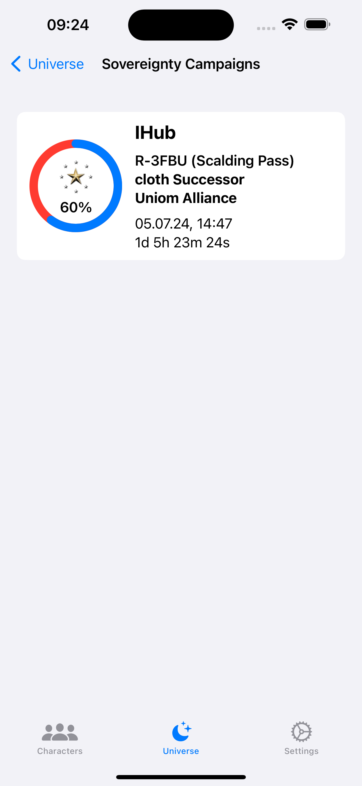
