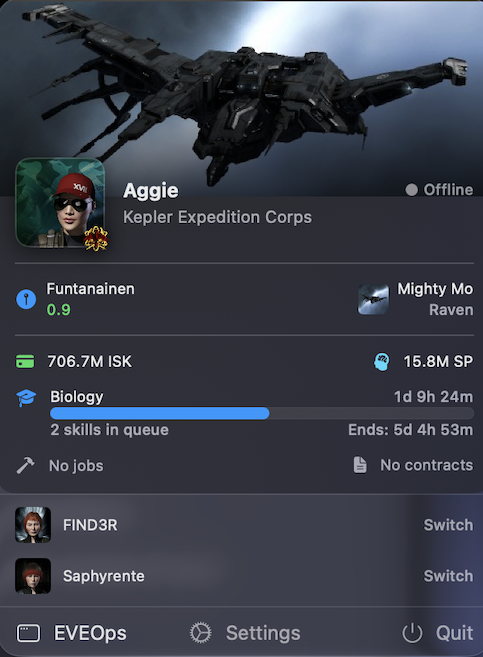
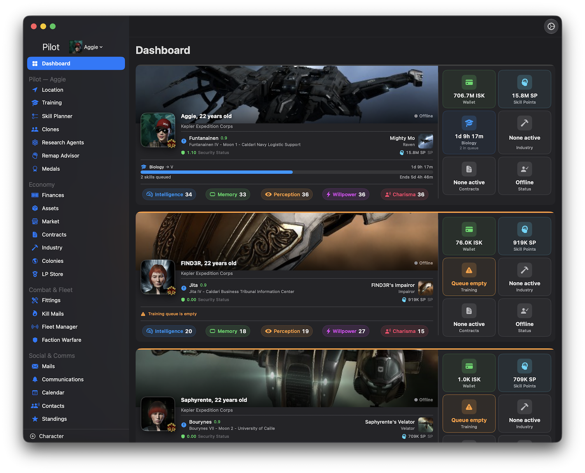

---
search:
  exclude: false

title: EVEOps # The title of your project, this should match the name of the directory that you are putting this file in, as it influences sorting. For the directory name, use kebab-case with lowercase letters.
type: Service  # Should be either 'service' or 'resource'
description: A native macOS companion app for EVE Online. Monitor up to three characters, and corporation at a glance, right from your menu bar. Want more - open the companion app to explore an entirely connected experience with your charcaters as if you were in-game.
maintainer:  # `name` is required, and exactly one of `github`, `gitlab`, or 'repository' is required
  name: Citizen Coder
  github: MikeManzo # GitHub username, this will generate a link to your GitHub profile
  repository: https://github.com/MikeManzo/EVEOps # If your source control is somewhere else, enter the full URL of your user profile
---

## Screenshots

## Features

EVEOps lives in your macOS menu bar and gives you instant visibility into your characters and corporation you manage. No browser tabs. No alt-tabbing. Just the information you need, always one click away.

### Full Character Support
- Add and manage up to three EVE characters from a single app
- Dashboard lists key stats

### Menu Bar Integration
- Persistent menu bar icon for instant access
- Character summary: wallet, ship, location, skill queue, industry jobs, contracts, PI colony status
- Online/offline status indicator (alpha - based on KillMails)

### Character Monitoring
| Section | What you see |
|---|---|
| **Dashboard** | Wealth, SP, online status, skill queue, jobs, contracts, PI alerts — all characters |
| **Location** | Current system, security status, ship name and type |
| **Training** | Active skill, queue length, finish times, empty queue warnings |
| **Finances** | Wallet balance, market orders, escrow, net worth charts |
| **Assets** | Full asset inventory with type icons and locations |
| **Clones** | Jump clones and implant sets |
| **Colonies** | PI colonies with extractor status and expiry alerts |
| **Contracts** | Outstanding and in-progress contracts |
| **Industry** | Active manufacturing and research jobs |
| **Mails** | EVE mail inbox |
| **Communications** | In-game notifications and alerts |

### Corporation Monitoring
| Section | What you see |
|---|---|
| **Assets** | Corporation-wide asset inventory |
| **Industry** | Active corporation manufacturing and research jobs |
| **Members** | Member roster |
| **Structures** | Deployed structures and their states |
| **Wallets** | Corporation divisional wallet balances |

### Smart Caching
- ESI response cache respects `Expires` headers — no unnecessary API calls
- Universe data (types, systems, regions, stations) persisted to disk with a 7-day TTL
- Name resolution cache persisted to disk across launches
- Dashboard data prefetched in the background on startup for instant display

### Background Monitoring & Notifications
- Background refresh keeps data current even when the window is closed
- Native macOS notifications for important events (skill queue empty, extractors offline, etc.)

### Security
- EVE SSO with OAuth 2.0 + PKCE — no passwords stored, ever
- Tokens stored securely in the macOS Keychain
- All communication goes directly to CCP's ESI — no middleman