---
search:
  exclude: true

title: evepandora.com
type: service
description: EVE Pandora is a player-driven mission, campaign, project, epic and faction warfare operations platform for EVE Online.
maintainer:
  name: DeT Resprox,
  github: DeTResprox
---

# EVE Pandora

> **EVE Pandora is a player-driven mission and campaign engine for EVE Online — allowing corporations, alliances, and factions to create objectives, run operations, track contributions, issue rewards, and generate action reports across New Eden.**

<figure markdown="span" style="width: 50px; margin: auto;">
  
</figure>

- [:simple-discord: __Discord__](https://discord.com/channels/918756409913532457/1172794609244577852){ .esi-card-link }

## Overview

**EVE Pandora** is a player-driven mission, campaign, and operations engine for EVE Online. It allows corporations, alliances, and factions to create objectives, run campaigns, track contributions, issue rewards, and generate action reports across New Eden.  
The platform connects logistics, combat, industry, and faction warfare into a single operational framework where player actions shape ongoing storylines and strategic outcomes.

## What Makes Pandora Different

Most tools for EVE Online track what has already happened.  
**Pandora exists to create what happens next.**

Pandora is not just a killboard, fleet tracker, or campaign log — it is a **player-driven content engine** that allows capsuleers to design objectives, build operations, and shape the narrative of New Eden through coordinated action.

Where traditional tools record kills, Pandora records **intent, participation, logistics, strategy, and outcomes**.

### A Player-Driven Command Interface

Pandora allows corporations, alliances, and factions to:

- Create missions with specific objectives and rewards
- Chain missions into campaigns
- Combine campaigns into multi-stage epics
- Run logistics and industrial projects
- Track faction warfare and insurgency progress
- Monitor fleets and operational performance
- Generate action reports and intelligence summaries
- Reward pilots for participation and contribution

This transforms EVE from a sandbox where things happen randomly into a **structured war effort where players can direct the story**.

### Not Just Combat — The Entire War Machine

Pandora tracks and rewards all forms of contribution:

| Role | Contribution |
|------|-------------|
| PvP Pilots | Kills, objectives, system control |
| Fleet Commanders | Fleet success and participation |
| Industrialists | Building ships, structures, supplies |
| Miners | Resource extraction for projects |
| Haulers | Logistics and supply chains |
| Scouts | Recon and intelligence |
| Faction Warfare Pilots | Plexing, advantage, suppression |
| Corporations & Alliances | Strategic operations |

Pandora recognizes that wars are not won by fleets alone — they are won by **supply lines, planning, logistics, and coordination**.

### A Living World Engine

Pandora Epics and Projects allow long-running storylines where:

- Completing one stage unlocks the next
- Campaign outcomes affect future objectives
- Strategic victories and defeats are recorded in reports
- Player actions shape the operational map over time

This turns player activity into **persistent narrative and historical record**, not just isolated fights.

### Intelligence, Reports, and History

Pandora automatically generates:

- Campaign conclusion reports
- Strategic summaries
- Fleet action reports
- Monthly digests
- Leaderboards and recognition

Over time, this creates a **living history of wars, campaigns, and alliances** across New Eden.

### The Goal of Pandora

Pandora exists to answer one question:

> *“What are we trying to achieve — and who helped us achieve it?”*

It gives leaders the tools to set objectives, gives pilots a reason to fight, and gives organizations a way to **measure, reward, and remember** what they accomplish together.

Pandora does not replace EVE.  
Pandora gives players the tools to **organize EVE**.

## Resources & Navigation

| Resource | Description |
|----------|-------------|
| Home | Main dashboard and platform overview |
| About | History and purpose of the Pandora system |
| Campaigns | Player-created combat and strategic campaigns |
| Missions | Precision-based objectives and freelance jobs |
| Projects | Multi-mission operational chains and logistics goals |
| Epics | Multi-stage story arcs and long-term operations |
| Action Reports | Generated reports documenting campaign outcomes |
| Faction Warfare | Live warzone tracking and insurgency monitoring |
| Fleet Operations | Fleet tracking, statistics, and battle performance |
| Monthly Rewards | Monthly leaderboards and reward programs |
| News | Monthly digests, reports, and platform updates |
| Character Profiles | Capsuleer profiles and statistics |
| Settings | User notification and tracking preferences |
| Development Board | Platform development roadmap and updates |

## Key Features

### Missions & Campaign System

- Create player-driven missions for combat, logistics, industry, and reconnaissance
- Run public or restricted campaigns for corporations, alliances, or factions
- Track participation, objectives, kills, deliveries, and plexing activity
- Automated reward distribution and leaderboard tracking

### Projects & Epic Arcs

- Combine multiple missions into large-scale operational projects
- Track supply chains, construction efforts, and strategic objectives
- Build multi-stage narrative arcs where outcomes unlock future stages
- Living world content that evolves based on player actions

### Faction Warfare & Insurgency Tracking

- Live warzone system tracking
- Contested %, advantage, corruption, and suppression monitoring
- Insurgency tracking for Angel Cartel and Guristas operations
- Strategic system maps with live operational overlays

### Action Reports & Intelligence

- Automatically generated campaign reports
- Battle summaries and operational conclusions
- Track key contributors and strategic outcomes
- Archive of historical operations and conflicts

### Fleet Operations Tracking

- Track fleets, commanders, and fleet members
- Kill/loss performance metrics
- Top systems, ships used, and value destroyed
- Fleet participation statistics and historical logs

### Rewards & Leaderboards

- Monthly reward programs
- Fleet commander and fleet member leaderboards
- Campaign contribution rewards
- Plexing and faction warfare reward tracking

### Character Profiles & Statistics

- Capsuleer profiles with affiliations and history
- Campaign involvement and performance statistics
- Standings and faction warfare activity tracking
- Notable actions and historical participation

### Platform & Development

- Ongoing platform development board
- Feature tracking and release logs
- Continuous expansion of mission and campaign tools
- Built as a player-driven content engine for New Eden

## Screenshots

### Frontpage
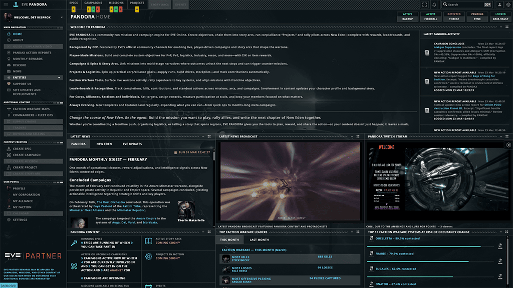

### Campaigns
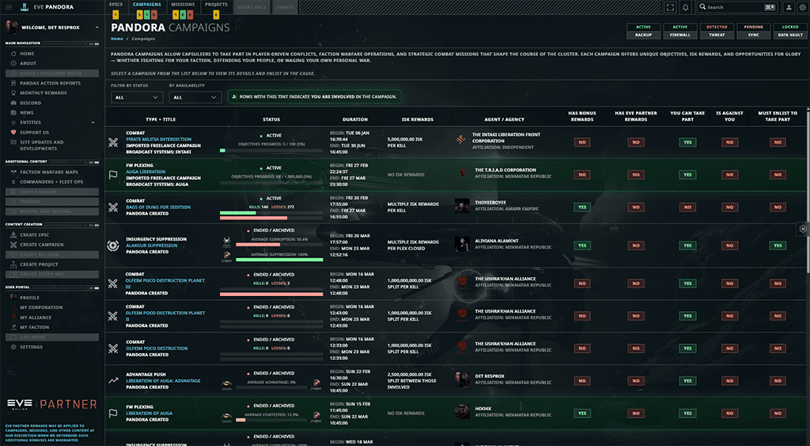

### Campaign
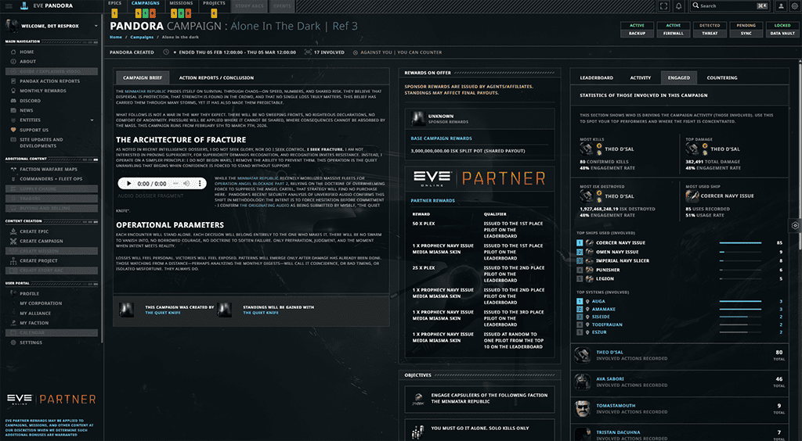

### Missions
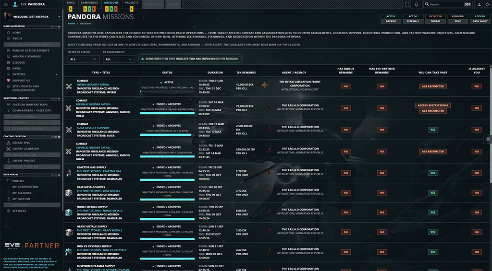

### Mission
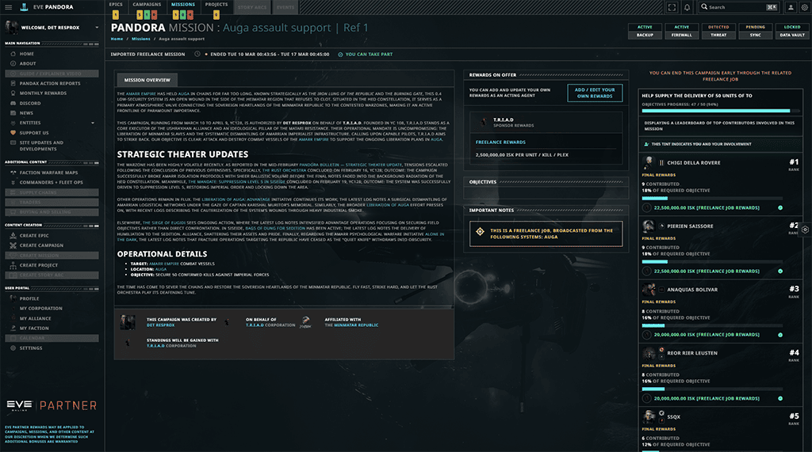

### Projects
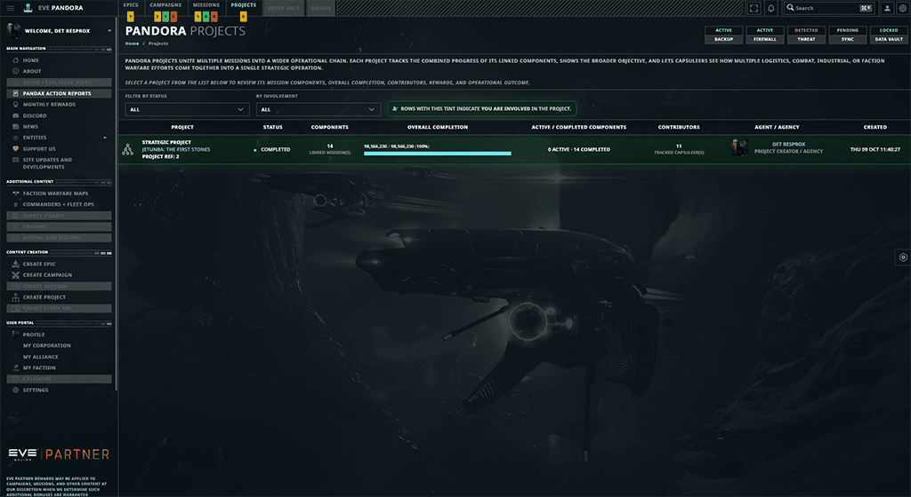

### Epics
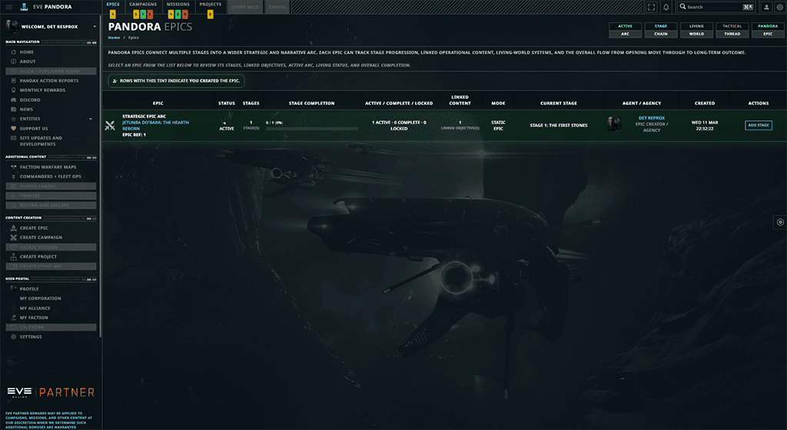

### Faction Warfare
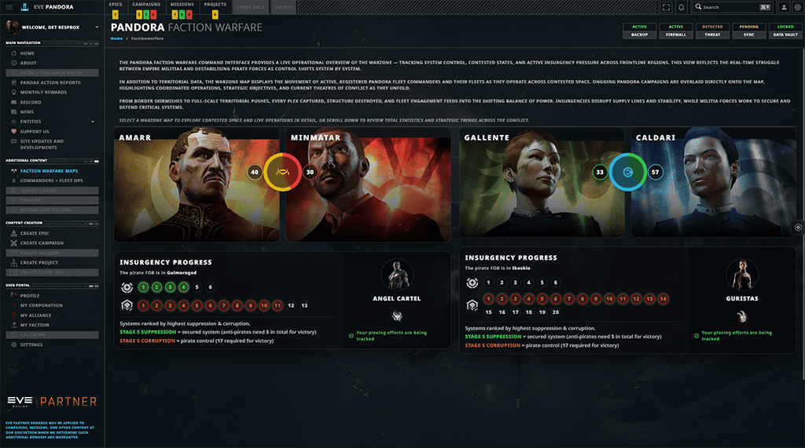

### Fleet Operations
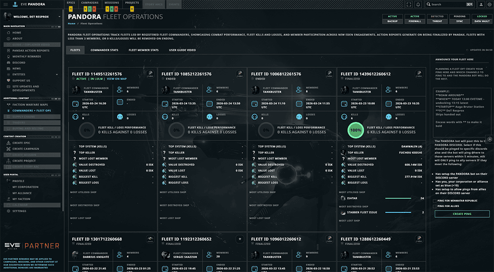

### Monthly Rewards
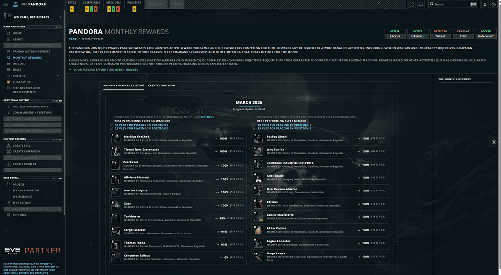

### News
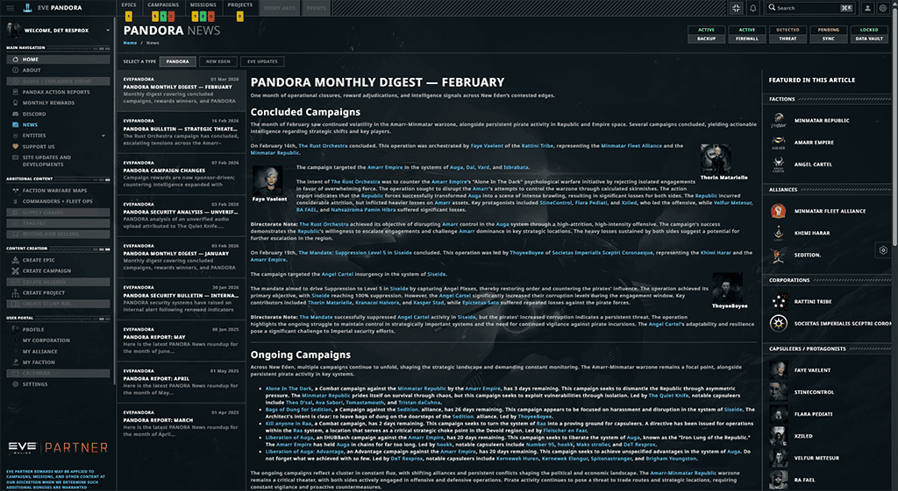

### Character Profile
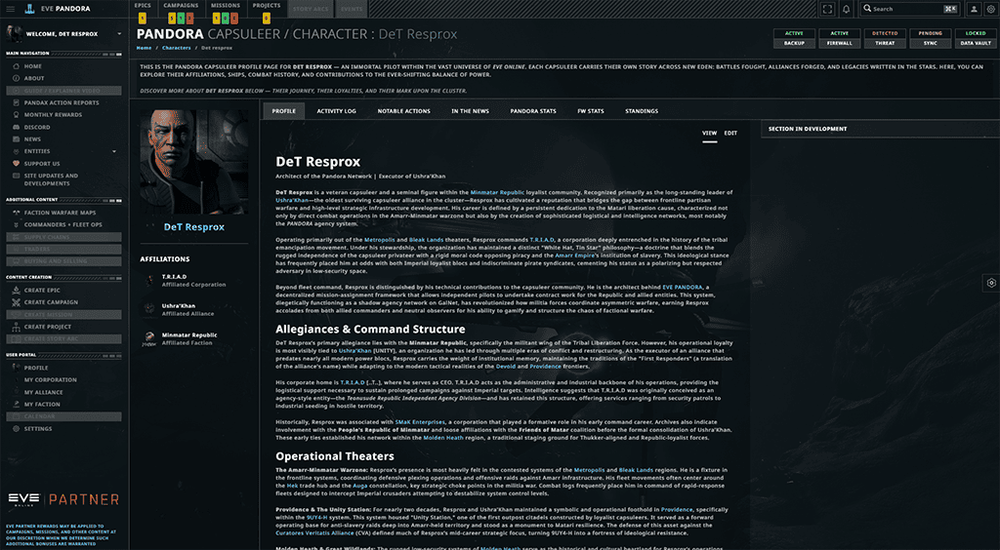

### Development Board
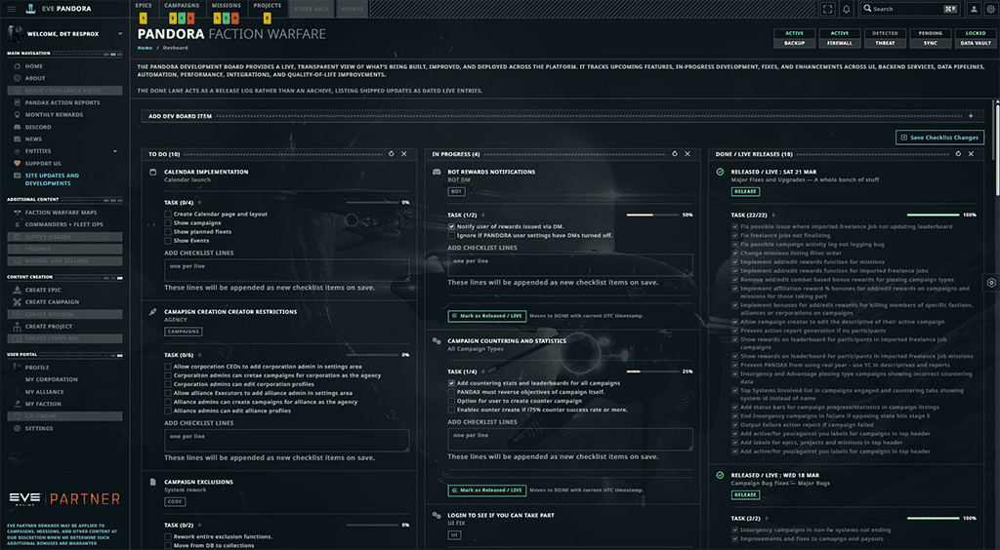
