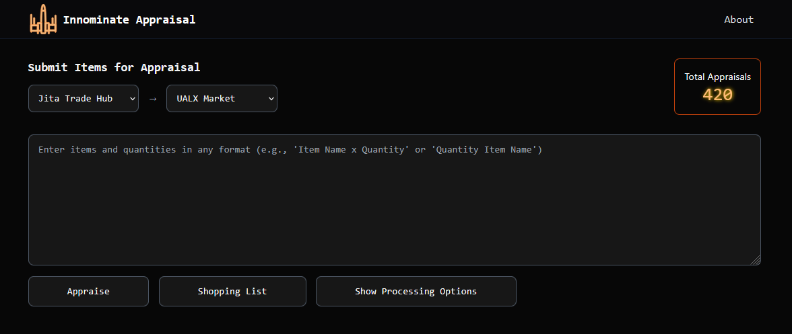
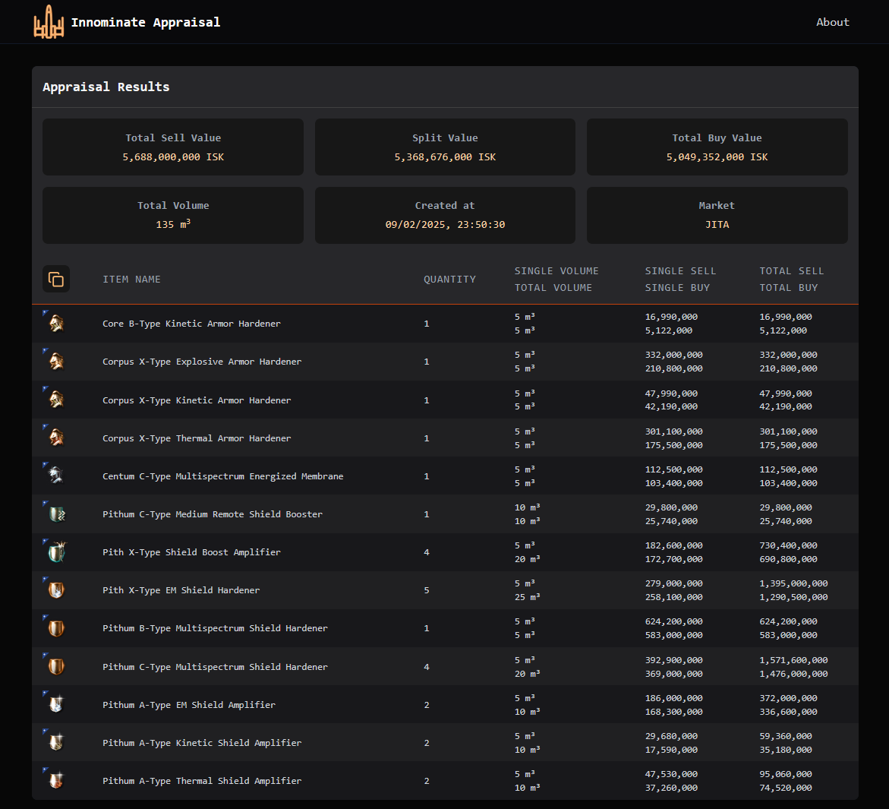
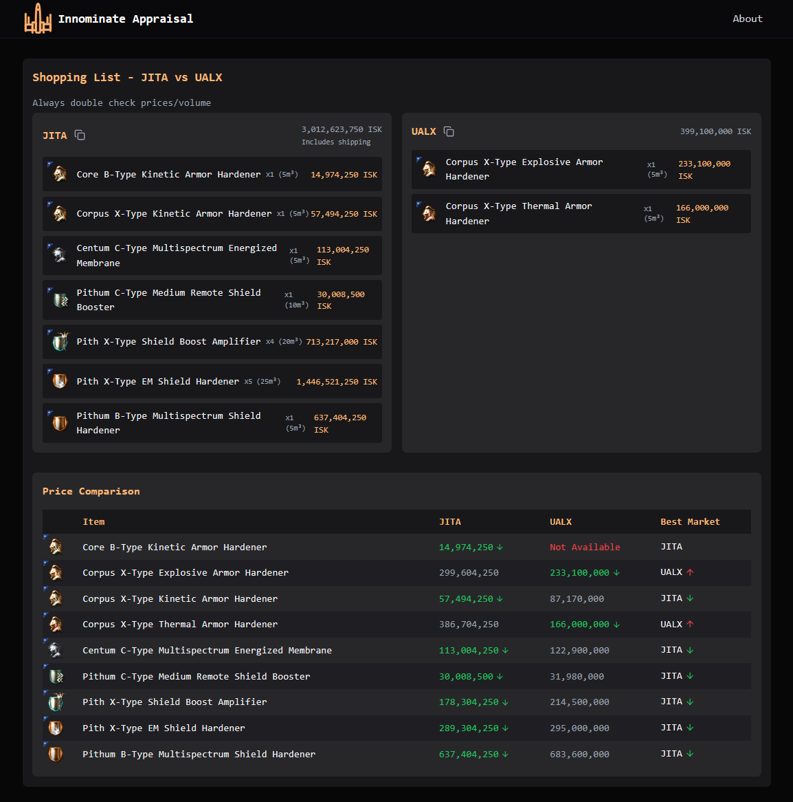
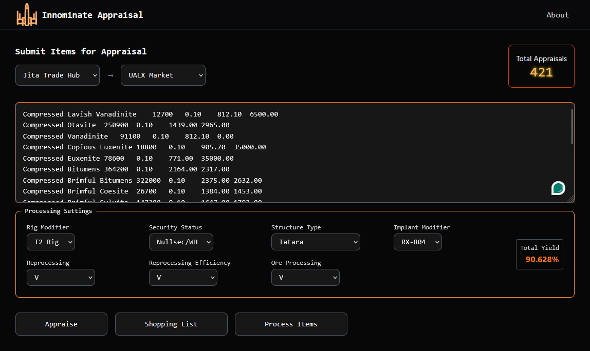
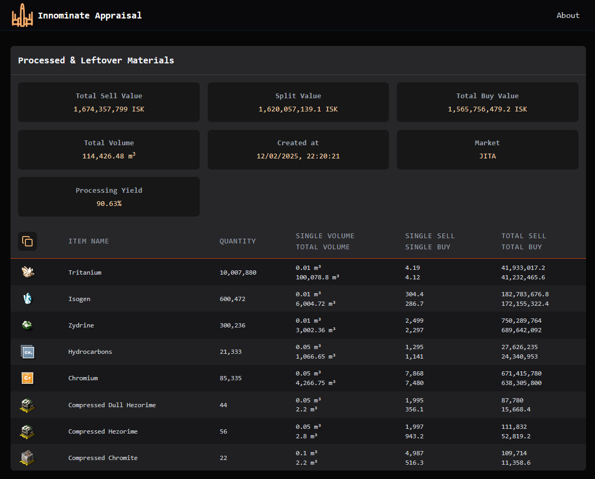
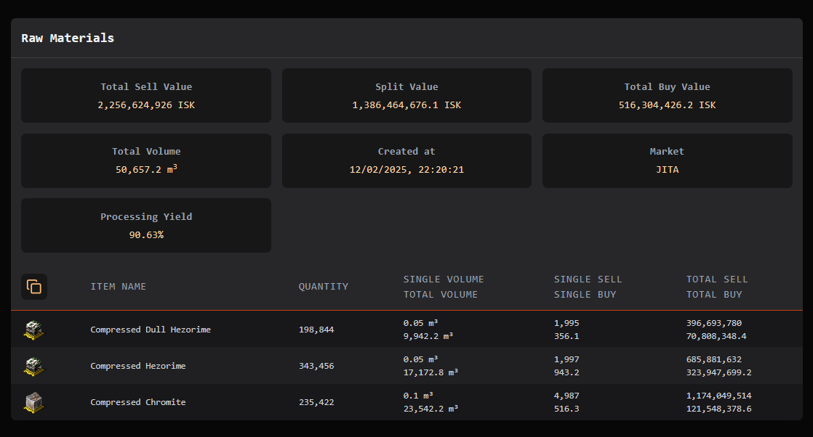

---
search:
  exclude: true

title: Innominate Appraisal
type: service
description: Web App for everyday Market PvP, Works on any devise with a browser. contains several features and appraisal methods for multiple market hubs.
maintainer:
  name: Mezoology
  github: mezoology
---

# Innominate Appraisal

Web App for everyday Market PvP, Works on any devise with a browser. contains several features and appraisal methods for multiple market hubs.

- [:octicons-browser-16: __Website__](https://innominate.iaam.top){ .esi-card-link }
- [:simple-discord: __Discord__](https://discord.gg/PsSqSGtjBp){ .esi-card-link }

## Appraisal

Simple appraisal feature with advanced user input parsing, supports many input formats with 1-click to copy the Raw input, and more...

## Market Compare

Shopping List like, the user adds his items, and it calculates which market is cheaper, then sorts the items into 2 groups for each market.

## Ore Processing

Ore processing feature with full control over the formula options. appraises both the Raw input and the processed minerals against the selected Market hub.

## Development

We are working on adding more features and supporting more market hubs in the near future.

