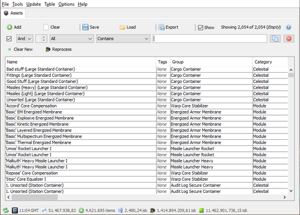
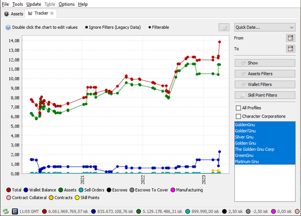
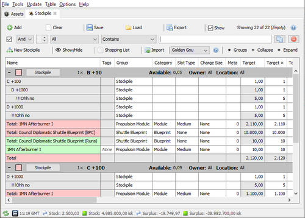

---
search:
  exclude: true

title: jEveAssets
type: service
description: jEveAssets is an out-of-game asset manager for Eve-Online, written in Java
maintainer:
  name: Golden Gnu
  github: goldengnu
---

# jEveAssets

- [:octicons-browser-16: __Website__](https://eve.nikr.net/){ .esi-card-link }
- [:simple-discord: __Discord__](https://discord.gg/8kYZvbM){ .esi-card-link }
- [:simple-github: __GitHub__](https://github.com/GoldenGnu/jeveassets/){ .esi-card-link }

## Features

- Assets - many ways to search and look through your assets
- Net worth tracker
- Journal
- Contracts
- Market orders and transactions
- Mining and extraction log
- Industry jobs
- And much more...

## Screenshots

