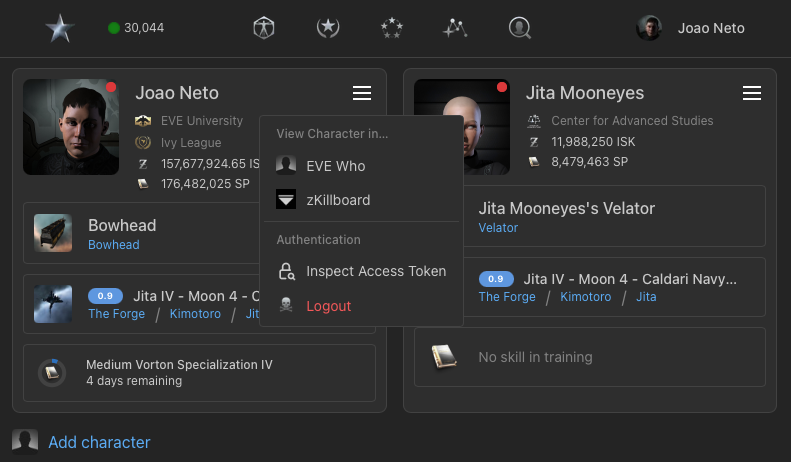
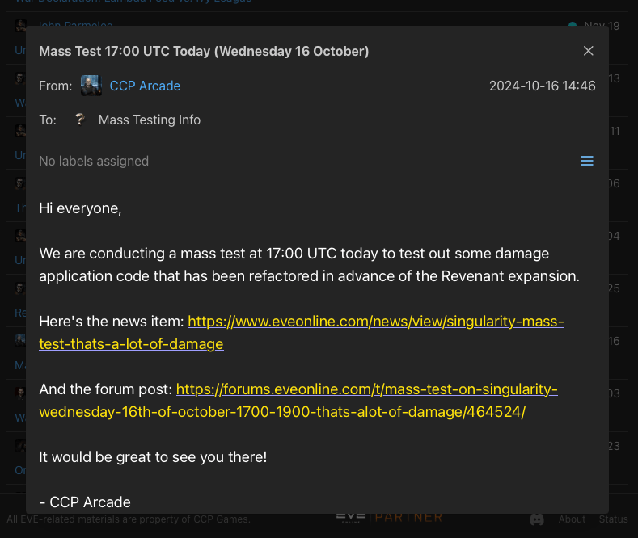
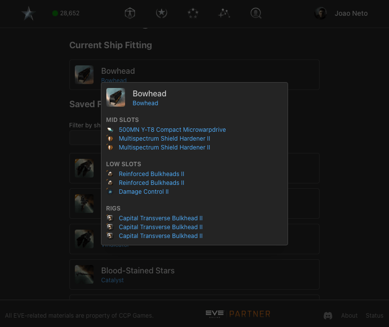
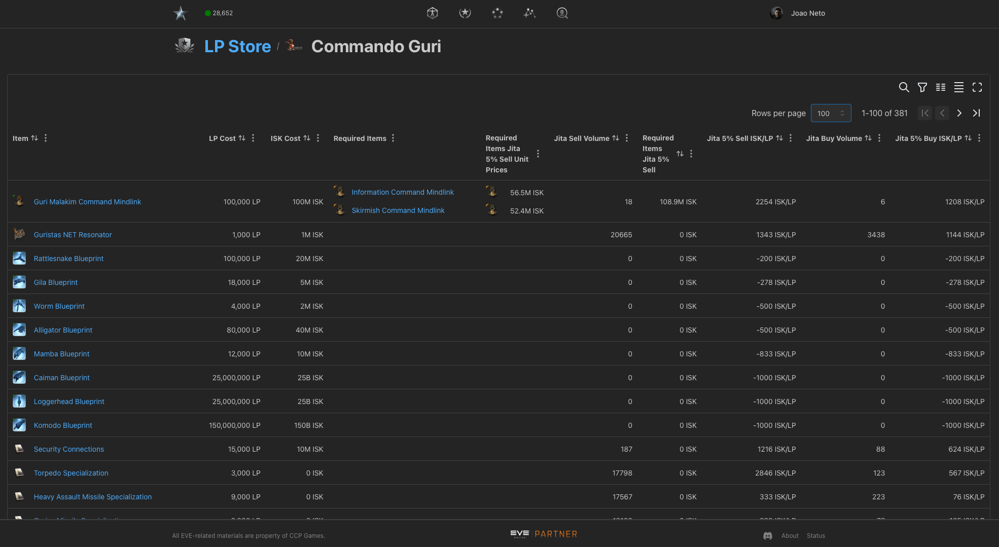
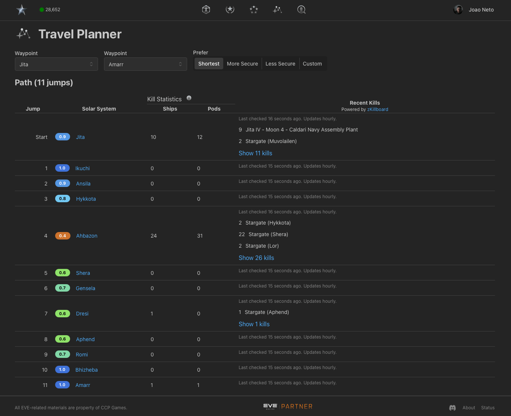

---
search:
  exclude: true

title: JitaSpace
type: service
description: All-in-one web application with an ever-expanding feature set of tools for EVE Online, from reading all your characters' EveMail in one place, to browsing the LP store offers.
maintainer:
  name: joaomlneto
  github: joaomlneto
---

# JitaSpace

All-in-one web application with an ever-expanding feature set of tools for EVE Online, combining the best of ESI data with a sleek UI.
Add multiple characters and view all their data in one place.

More tools coming soon, so check back often!
If you have any suggestions, feel free to [reach out](https://www.jita.space/about).

_JitaSpace does not store any of your EVE data: everything is stored locally in your device._

- [:octicons-browser-16: __Website__](https://www.jita.space){ .esi-card-link }
- [:octicons-mark-github-16: __GitHub__](https://www.github.com/joaomlneto/jitaspace){ .esi-card-link }

## Character Tools
View your EVEMail, Fittings and more from multiple characters in one place.

## Universe Data Browser
Browse through information about EVE Online, including Agents, LP Stores, and more.

