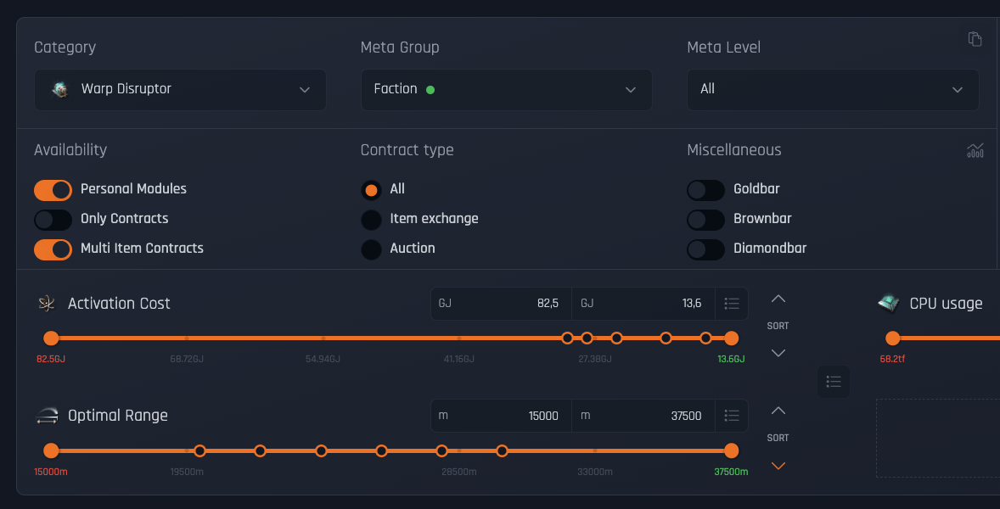
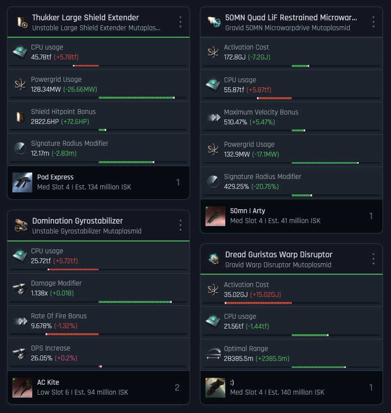

---
search:
  exclude: true

title: MutaMarket
type: service
description: Web tool for managing abyssal modules. Import modules, browse contracts, and analyze values with ease.
maintainer:
  name: Nicolas Kion
  github: nicolaskion
---

# MutaMarket

A free web-based platform to seamlessly manage, analyze, and share abyssal modules. We provide a comprehensive inventory management system, live contracts, and an advanced calculator to help you make informed decisions and maximize your profits.

- [:octicons-browser-16: **Website**](https://mutamarket.com){ .esi-card-link }
- [:simple-discord: **Discord**](https://discord.gg/FuwdBZ5cXq){ .esi-card-link }
- [:simple-github: **GitHub**](https://github.com/nicolaskion){ .esi-card-link }

## Contract Browser

The Contract Browser module provides a technical interface for querying and filtering live abyssal module contracts. Key features include:

- **View Modes:** Toggle between grid and list views for optimal data presentation.
- **Sorting & Filtering:** Sort contracts by price, module attributes, and availability. Apply filters by module type, meta group, and other parameters.
- **Detailed Data:** Each listing displays attribute bars and key statistics for easy comparison.

*Filtering options for live abyssal module contracts.*

## Inventory Management

The Inventory Management system is designed to keep an accurate record of your abyssal modules. It supports multiple import methods:

- **ESI Integration:** Automatically imports module data directly from EVE Online’s API.
- **EveMail Import:** Processes module information sent via EVE Mail.
- **Manual Import:** Accepts pasted chat messages to capture module details.
  The interface displays modules with visual cues and attribute scores, making it simple to identify and manage valuable rolls.

*Lists of modules with visual cues and attribute scores.*

## Probability Calculator

This tool calculates the odds of achieving desired module attributes and estimates associated costs. It features:

- **Statistical Analysis:** Computes the likelihood of rolling specific stats based on current market data.
- **Cost Estimation:** Provides an expected cost value for obtaining certain module attributes.
- **Data-Driven Insights:** Uses both inventory and market data to support informed decision-making during module mutation and trading.

## Trading System

The built-in Trading System facilitates direct communication between players about module transactions. Its capabilities include:

- **In-Platform Messaging:** Allows users to negotiate, share module details, and coordinate trade offers without leaving MutaMarket.
- **Transaction Coordination:** Simplifies the process of arranging trades and verifying module details.
- **Integrated Workflow:** Seamlessly links trading communications with other management features.

## Collections

Collections enable users to organize modules into custom groups for easier reference and sharing. Features include:

- **Grouping & Organization:** Create user-defined sets (e.g., by ship fit, module type, or valuation).
- **Annotation:** Add notes to individual modules within a collection for additional context.
- **Visibility Settings:** Configure collections as private or public, allowing for controlled sharing with the community.

## Module Database

Our database is the comprehensive repository for abyssal module data. It offers:

- **Advanced Search:** Locate modules based on type, attributes, or custom criteria.
- **Detailed Records:** Each module entry includes images, numerical attributes, and valuation estimates.

