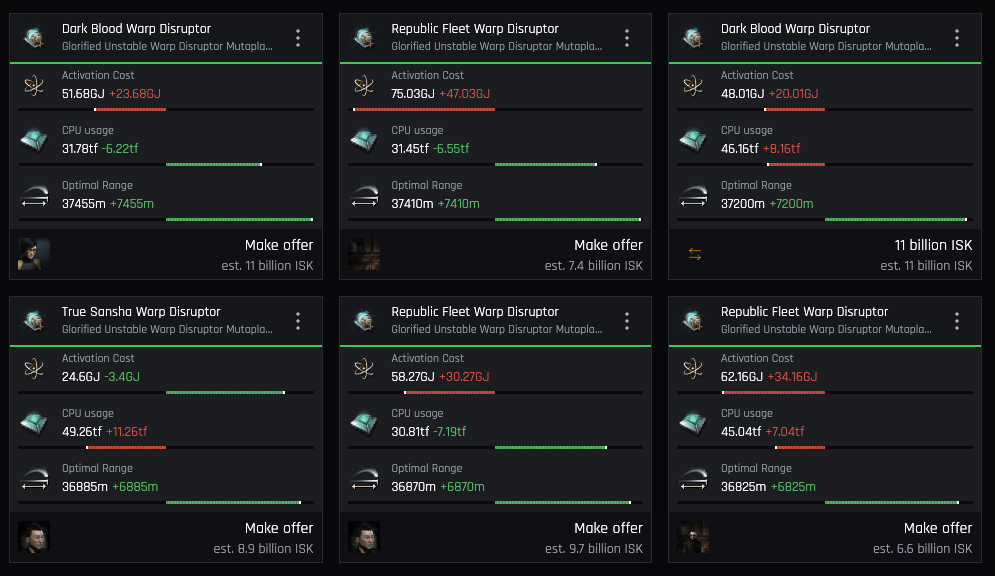
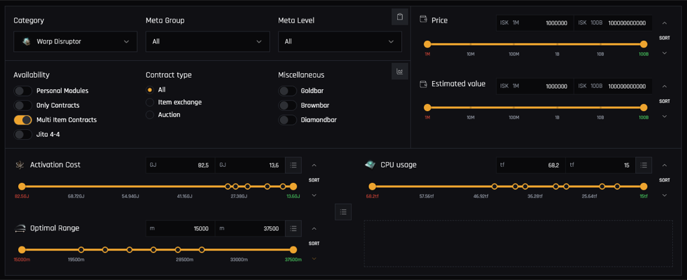
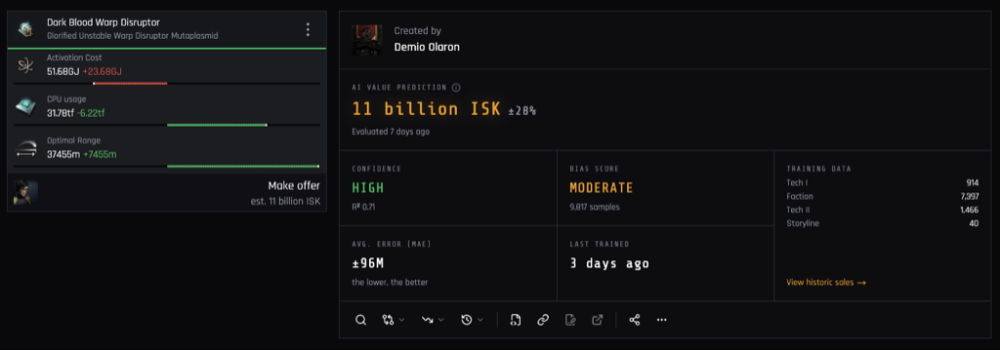
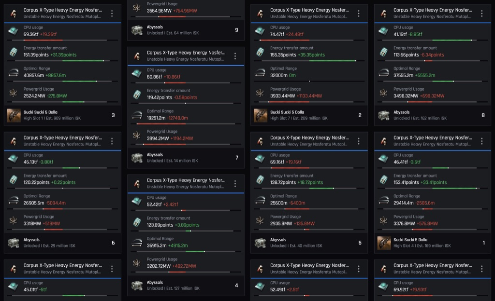

---
search:
  exclude: true

title: MutaMarket
type: service
description: The marketplace for abyssal modules. Browse contracts, appraise your rolls, and trade with other capsuleers.
maintainer:
  name: Nicolas Kion
  github: nicolaskion
---

# MutaMarket

{ width="128" }

Every abyssal module is a unique roll, so the regular market can't price or list them. MutaMarket does: it keeps a database of mutated modules, estimates their value, and connects buyers and sellers.

- [:octicons-browser-16: **Website**](https://mutamarket.com){ .esi-card-link }
- [:simple-discord: **Discord**](https://discord.gg/FuwdBZ5cXq){ .esi-card-link }
- [:simple-github: **GitHub**](https://github.com/MutaMarket/MutaMarket){ .esi-card-link }
- [:octicons-code-16: **API Documentation**](https://mutamarket.com/api/documentation){ .esi-card-link }

## Browsing

The browser lists every abyssal module currently for sale, from public in-game contracts and MutaMarket listings. You can filter by module type, rolled attribute ranges, meta level, price, and estimated value, and sort by any stat. Notably good rolls are flagged, and a contract can be opened directly in the game client.

*Modules for sale, with attribute bars and estimated values.*

*Filters for type, rolled attributes, price, and roll quality.*

## Appraisal

Paste an in-game item link and MutaMarket reads the module's rolled stats from ESI and estimates its value. Estimates come from machine-learning models trained per module type on recorded sales, and each model's accuracy statistics are public. A mutation calculator computes the probability of hitting chosen attribute ranges before you roll.

*A module's value prediction, with the model's confidence and accuracy.*

## Selling and trading

Import your assets, mark a module as public, and it is listed for sale. Buyers send offers through the site and both sides negotiate in a built-in message thread. Notifications arrive in the app, by EVE mail, and optionally on Discord.

## Inventory

MutaMarket imports abyssal modules from all your characters via ESI, showing what you own, where it is stored, and what it is worth. Collections group modules into public or private sets and can sync automatically with selected in-game locations on every asset import. A shareable workbench compares modules side by side.

*Your modules, grouped by where they are stored, with estimated values.*

## Developer API

A free public JSON API exposes modules for sale (with the full filter syntax), single-module lookups, module imports, and per-type roll statistics. No authentication is required. The [API documentation](https://mutamarket.com/api/documentation) is interactive and includes an OpenAPI spec and a Postman collection.
