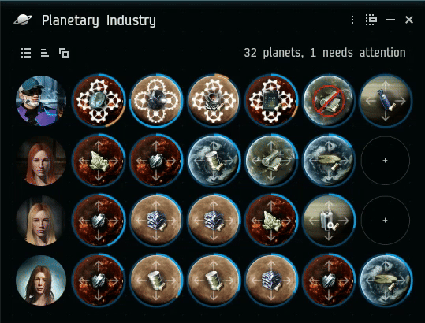
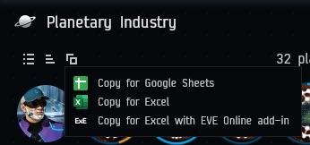

---
search:
  exclude: true

title: RIFT Intel Fusion Tool
type: service
description: Desktop app for Windows, Linux and macOS. Intel channels monitoring, flexible alerts, advanced map, PI, assets and more.
maintainer:
  name: Nohus
  github: nohus
---

# RIFT Intel Fusion Tool

All-in-one desktop app for Windows, Linux and macOS with an extensive feature set and a sleek UI blending in with EVE.

Make use of your ESI data locally, without sending it off to web services you don't control.

- [:octicons-browser-16: __Website__](https://riftforeve.online){ .esi-card-link }
- [:simple-discord: __Discord__](https://discord.gg/FQPVs5hnaZ){ .esi-card-link }
- [:simple-gitlab: __GitLab__](https://gitlab.com/rift-intel-fusion-tool/rift-intel-fusion-tool){ .esi-card-link }

## Map

The built-in live map shows the information you want, including current and past intel reports, and kills from killboards.
It's configurable, allowing to set up coloring, backgrounds cells, indicators, and info boxes to show any of tens of types of information.
It also shows the location of your characters, and has all the interactive features you'd expect.

## Planetary Industry

View all your colonies with real-time details.
Fast-forward to the future and see issues like storages getting full or production stopping before they happen and set up alerts for them.
Export all your data to a spreadsheet, if that's your thing.

## Characters

RIFT works with multiple characters, and you can instantly view the status of each, including jump clones and implants.
Includes a feature to easily copy in-game settings like window positions and buttons between your characters.

## Intel Reports

Are you in an alliance with intel chat channels? Monitor them all in one place with state-of-the-art parsing that presents
intel reports in a visual way.

## Intel Feed

View live intel, whether from intel reports or killboard feeds. Filter, sort and dig-in.
Lookup any character or view it on the map with one click.

## Alerts

Use customizable alerts to notify you of any event, whether it's someone mentioning your name in chat,
a hostile being reported in a nearby system, or just play a sound when you get decloaked.

## Contacts

View your contacts across all characters, including corporation and alliance contacts. Add, edit, remove, set standings,
assign labels. Search for any entity or item in the game.

## Assets

Browse through your assets from all characters.
Sort, search, copy and view fittings, and find on which alt you misplaced that ship.

And many more features!
