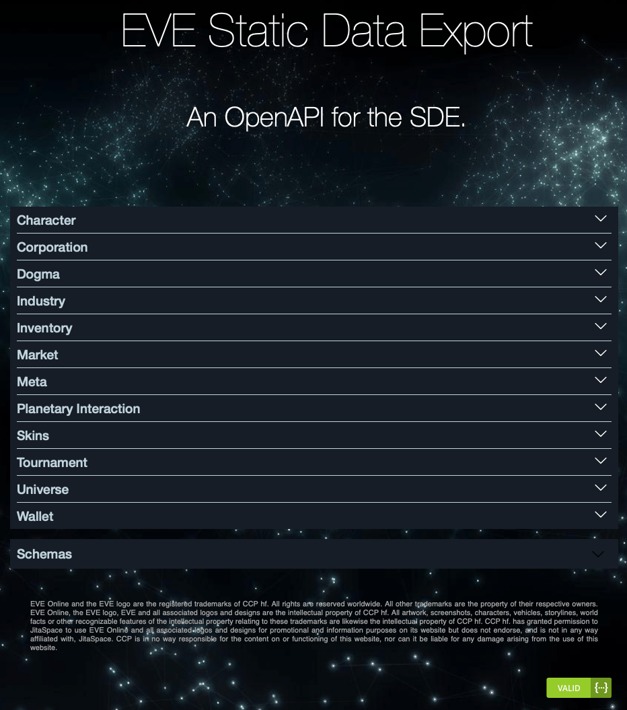

---
search:
  exclude: true

title: SDE REST API
type: resource
description: REST API for the EVE Static Data Export (SDE)
maintainer:
  name: joaomlneto
  github: joaomlneto
---

# JitaSpace SDE REST API

- [:simple-github: __GitHub__](https://github.com/joaomlneto/jitaspace){ .esi-card-link }
- [:octicons-browser-16: __Swagger UI__](https://sde.jita.space){ .esi-card-link }

## Description

JitaSpace offers an ESI-like API for the [Static Data Export (SDE)](https://developers.eveonline.com/docs/resources/) at [sde.jita.space](https://sde.jita.space), allowing you to access _the missing bits_ in the same way!

It parses all the data available in the [SDE](https://developers.eveonline.com/docs/resources/), complementing it with [Hoboleaks data](https://sde.hoboleaks.space), and provides a RESTful API to access it.

