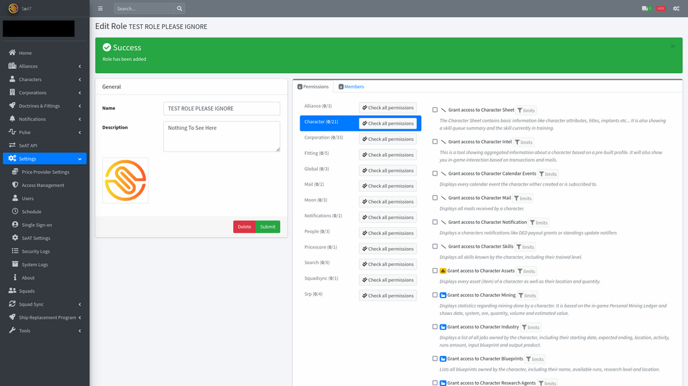

---
search:
  exclude: true

title: SeAT
type: service
description: SeAT is a simple Corporation and API management tool for collecting and utilising all ESI data.
maintainer:
  name: EveSeat Team
  github: eveseat
---

# SeAT - Simple, EVE Online API Tool

<figure markdown="span">
  
</figure>

- [:simple-discord: __Discord__](https://discord.com/invite/NQhnMKhc){ .esi-card-link }
- [:simple-github: __GitHub__](https://github.com/eveseat/seat){ .esi-card-link }
- [:octicons-book-16: __Documentation__](https://eveseat.github.io/docs/){ .esi-card-link }

## Description

SeAT is a simple, [EVE Online](https://www.eveonline.com/) Corporation and API management tool. SeAT allows you to keep an eye on all things related to your characters, corporations and alliances; from wallets, to mail, to assets for both characters and corporations. It is intended to be installed on a public server and installed for members of your organisation to access.

It is also commonly used by individuals to manage their own accounts; aw well as by alliances and coalitions for API based member management, counter-intelligence and administration. There are installations with the number of registered characters ranging from single digits all the way to in excess of 30,000.

## Features

- Consumes ESI data of registered characters from onl publicData up to all available read scopes of ESI. This includes character, corp and alliance data.

- Advanced role based access control to allow permissions over viewing and modifying data over the application. See info on [Roles](https://eveseat.github.io/docs/admin_guides/authorizations/).

- Allows automation of roles / permissions based on API data as well as manual methods. See info on [Squads](https://eveseat.github.io/docs/admin_guides/squads/).

- Community Packages to extend functionality with tools such as SRP programs, Discord / Teamspeak (and others) account linking and management, industry planning and management. See the list [here](https://eveseat.github.io/docs/community_packages/#package-list)

- Easy to deploy docker installation available and recomended! [Docs](https://eveseat.github.io/docs/installation/docker_installation/)

- English :flag_gb:, Chinese :flag_cn:, French :flag_fr:, German :flag_de:, Japanese :flag_jp:, Korean :flag_kr:, Romanian :flag_ro: and Russian :flag_ru: Localization (at varying levels of completion. See [here](https://translations.eveseat.net/)).

For more info please see our documentation, or come and have a chat to us in Discord!

## Screenshots

**User Home Page**

**Character Sheet Example**

**Corporation Extractions Example**

**Corporation Industry Example**

**Role Configuration Page**

## Core Packages

For the **actual** SeAT source, please refer to the following package repositories:  

| Package Name   | Version       | Downloads |
|----------------|:--------------|:----------|
| [api](https://github.com/eveseat/api) |  |  |
| [eveapi](https://github.com/eveseat/eveapi) |  |  |
| [eseye](https://github.com/eveseat/eseye) |  |  |
| [notifications](https://github.com/eveseat/notifications) |  |  |
| [services](https://github.com/eveseat/services) |  |  |
| [web](https://github.com/eveseat/web) |  |  |

# Community Packages

SeAT on its own provides powerful access to data available over ESI. However, in order to customise the use of this data and extend the functionality of SeAT there are also various plugins that can be installed and listed here!

- [:octicons-plug-16: __Community Packages__](https://eveseat.github.io/docs/community_packages/#package-list){ .esi-card-link }

