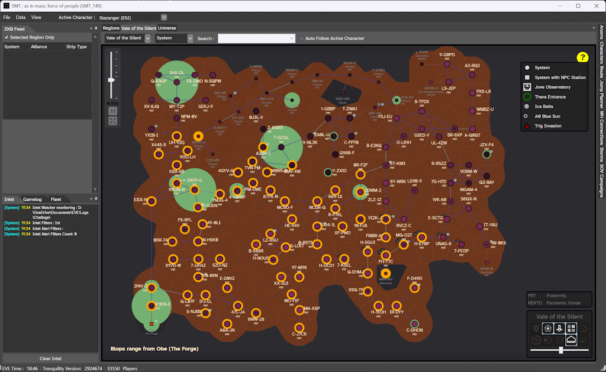
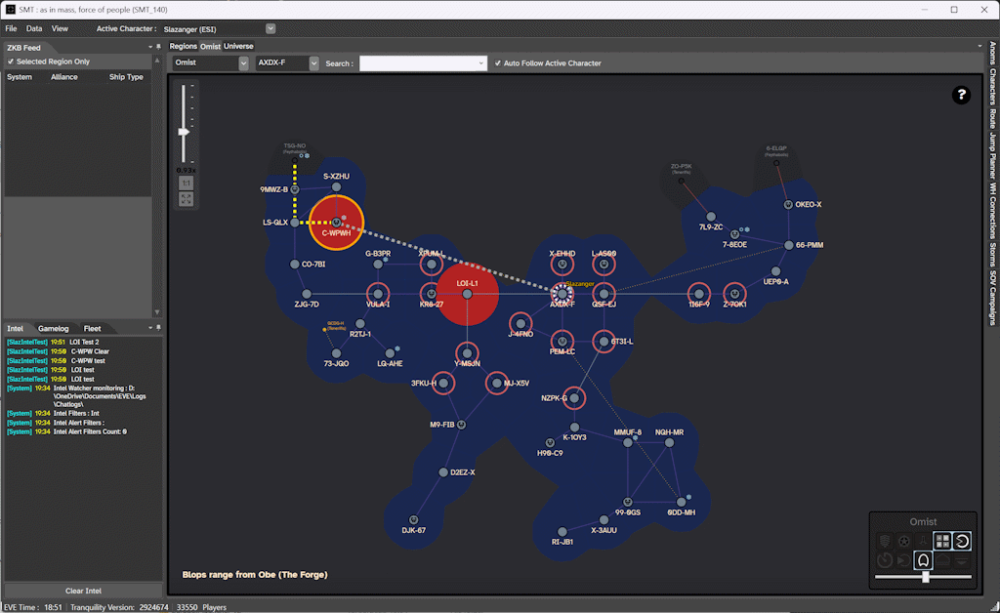
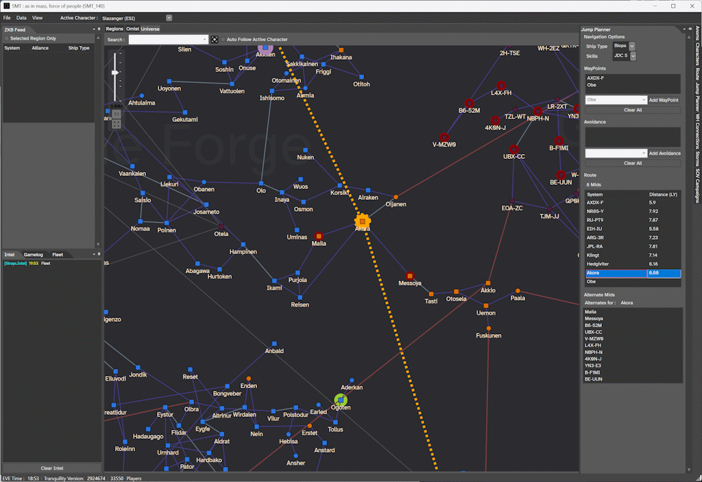

---
search:
  exclude: true

title: SMT
type: service
description: Slazanger's Map Tool
maintainer:
  name: Slazanger
  github: Slazanger
---

# SMT

 SMT is standalone desktop map tool

- [:simple-discord: __Discord__](https://discord.gg/QSuJjNn){ .esi-card-link }
- [:octicons-mark-github-16: __GitHub__](https://github.com/Slazanger/SMT){ .esi-card-link }

## Features

- **Character Tracking**: Track your characters across New Eden
- **Improved Maps**: Region & Universe level maps much easier to use than the in-game map
- **Improved Navigation**: Calculate the fastest routes across the map; use Ansiblex Gates, Thera, Turnur, Zarzakh to your advantage
- **Data Overlay**: Overlay data from ESI & Community services.. track kills, storms, incursions, SOV, timers, wormholes
- **SOV**: Easily see who owns what space, what relationship they are to you, what the adm's are, what the active sov campaign timers and stats are, whats coming out soon
- **Overlay**: Simple overlay option to help optimise screen realestate

## Hunter/Hunted
- **Hunting Mode**: See where the activity is across New Eden... find your target, check range maps, track bridgers and Hunt
- **Anti-Hunting Mode**: Organise to defend against hunters.. display your intel, set alarms and notifications defend against incoming hunters

## Examples

... And Plenty more..