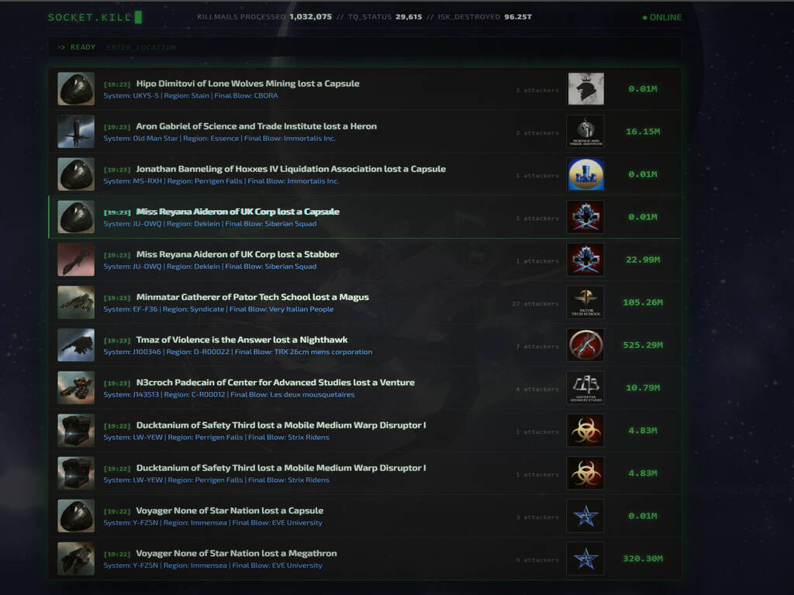

---
search:
  exclude: true

title: socketkill.com
type: service
description: socketkill.com is a high performance web site streaming live kill mails, design focus is optimisation and aesthetics. 
maintainer:
  name: Dexomus Viliana
  github: scotdex
---

# socketkill.com

- [:octicons-browser-16: __Website__](https://socketkill.com){ .esi-card-link }
- [:simple-github: __GitHub__](https://github.com/ScotDex/socketkill-v2){ .esi-card-link }
- [:simple-discord: __Discord__](https://discord.gg/UnFN8UY6Dz){ .esi-card-link }

## About

Socket.Kill or socketkill.com is a stateless high performance web site to stream live kill mails, design focus is optimisation and aesthetics. The site is designed with a blend of eve online aesthetics fused with the CRT monitor effects from the alien franchise. Winner of new dev of the year at the eve creator awards fanfest 2026

Visit [About](https://socketkill.com/about/) to learn more

## Features

- Multimode Filter (Corp, System, Region, Alliance) to monitor kills as the arrive
- NPC Global Death Counter
- Public web socket access with integrated schema validation.
- Discord Killmail Relay with multiple categories.
- Selectable Killmails for further inspection.
- ISK Destroyed Counter (From 14th Jan 2026)
- Automated posting to X and BlueSky with 40 bill isk threshold.
- Query builder to review daily kill mails. (Coming soon)
- Killmail RAW data access for further dev opportunities.

## Infrastructure

- Zero Onboard Database & No Fully Stored Killmails
- Tailwind/Svelte/Astro
- Cloudflare Workers
- R2 & KV Persistence
- Image Proxy for performance boost

## Use Cases

- Observing an ongoing battle (filter x2 alliances)
- Hunt a region (Filter for black rise)
- Locate officers for that juicy purple loot (Discord tracker)
- Who is smartbombing in the area (Filter "Smartbomb" & Region) - Coming soon TM

## Screenshot

## API

API documentation can be found [here](https://api.socketkill.com/docs/).

