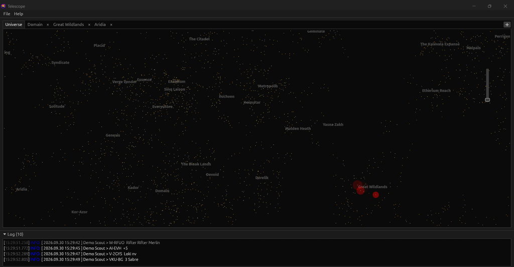
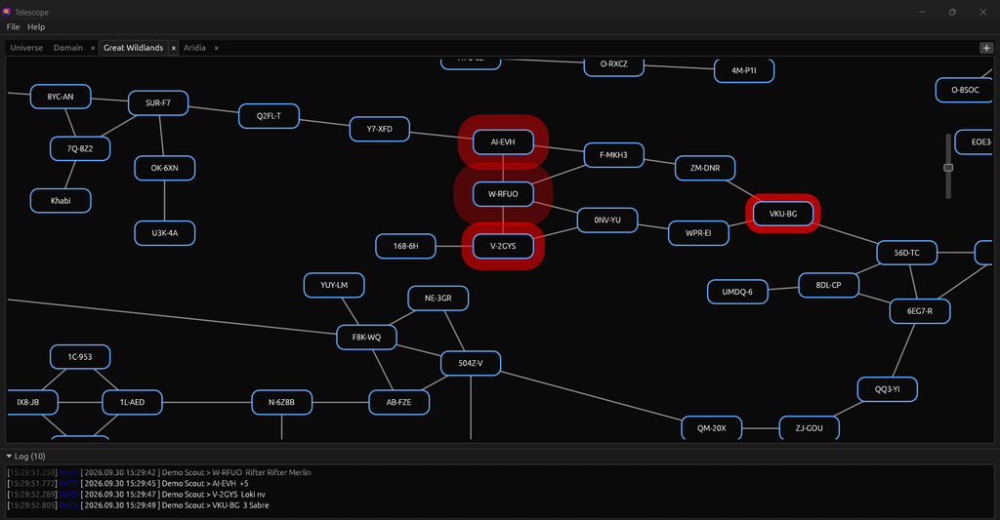
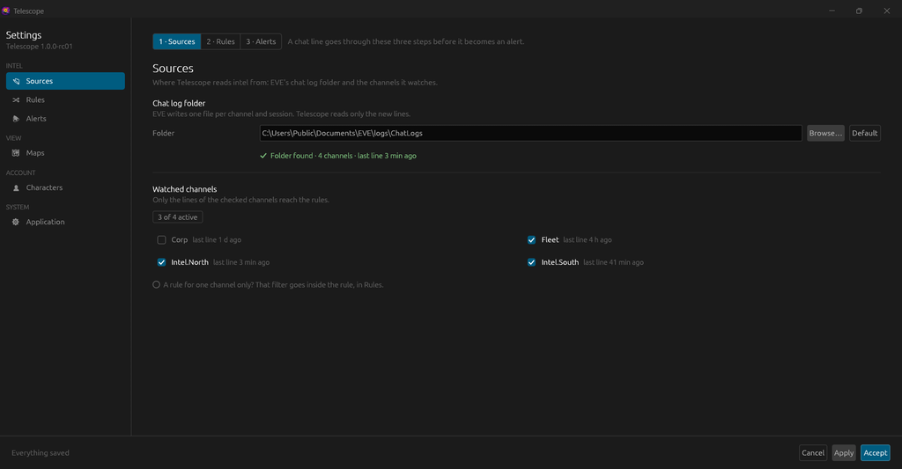
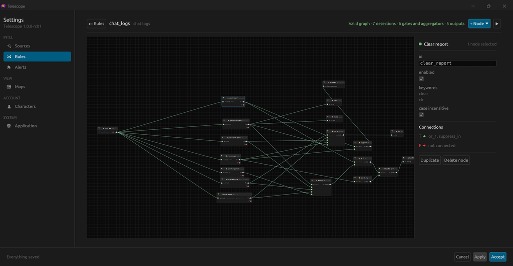
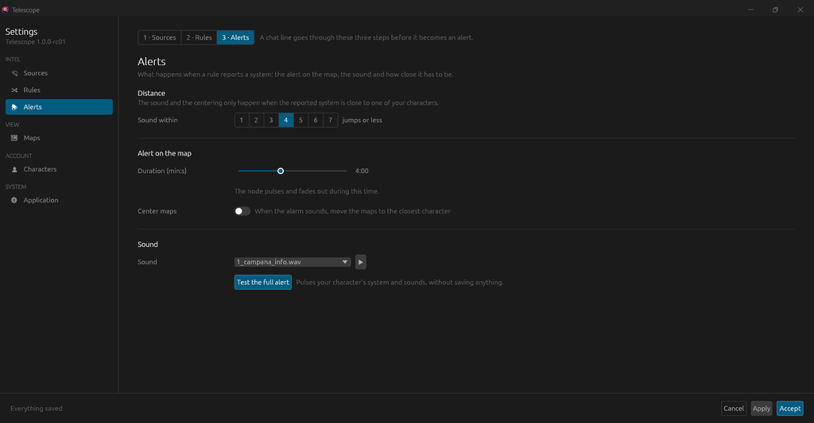
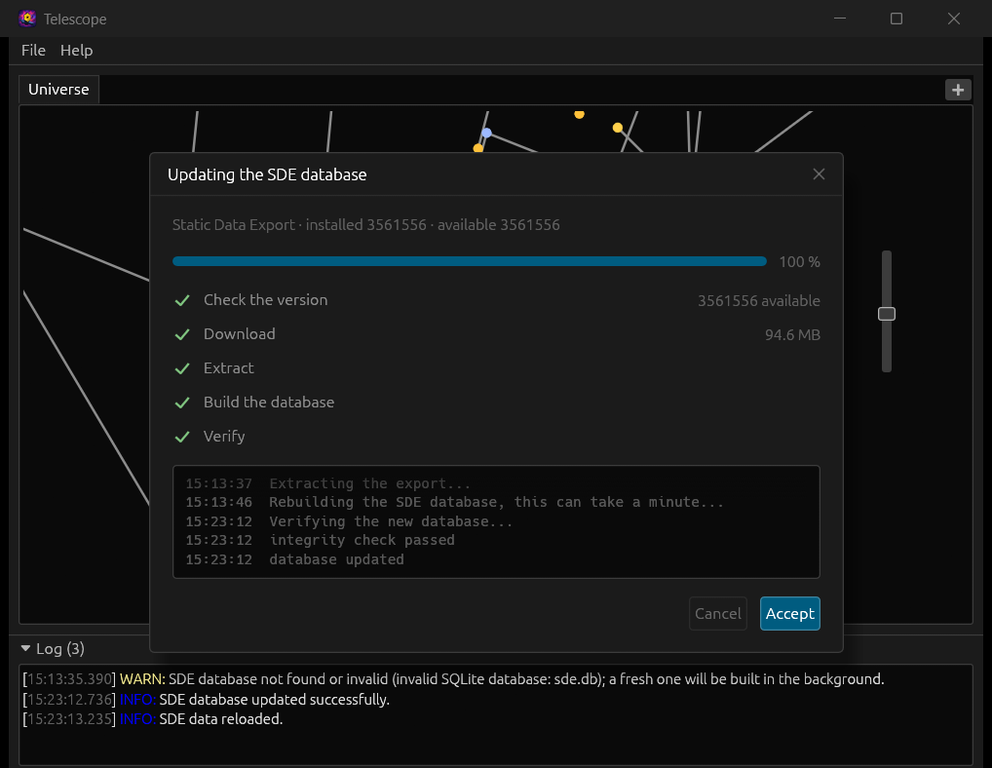
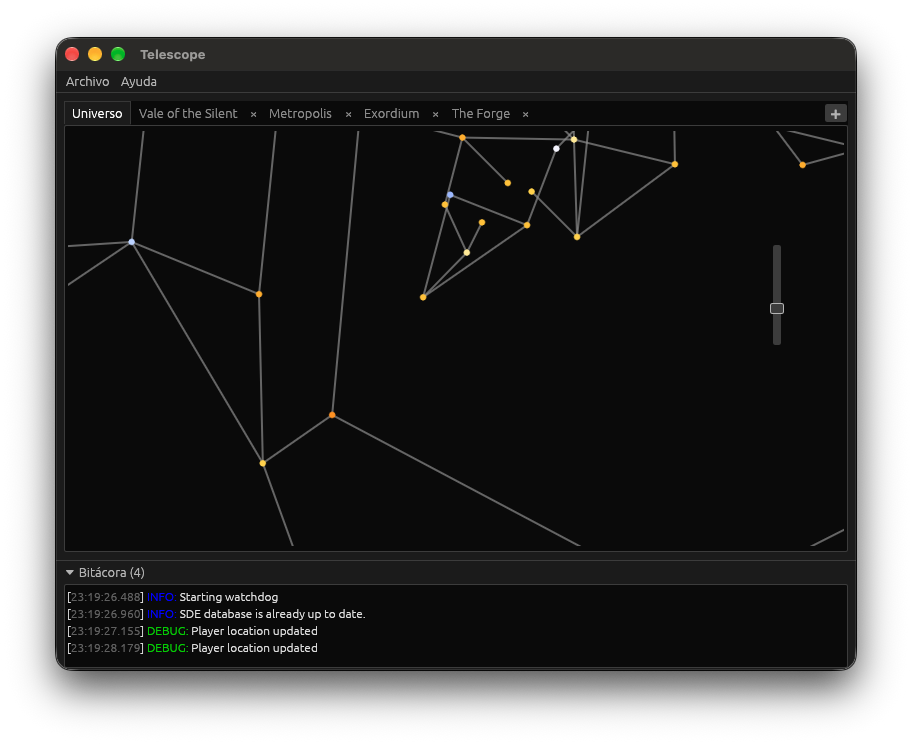

---
search:
  exclude: true

title: Telescope
type: service
description: Cross-platform desktop app that watches your EVE Online chat logs and shows intel alerts on interactive maps.
maintainer:
  name: rafaga
  github: rafaga
---

# Telescope

Telescope is a desktop application that watches your EVE Online chat logs, evaluates them against configurable pattern rules and shows the resulting alerts on interactive maps of New Eden. Characters linked through EVE SSO are followed through ESI, so the maps can show where they are and warn about nearby threats.

It is similar to other intel gathering tools, but with some key differences:

- Designed to be multiplatform (Windows, macOS and Linux).
- Designed to be as easy to use as possible.
- Designed with privacy in mind: your data stays on your computer.

- [:octicons-mark-github-16: __GitHub__](https://github.com/rafaga/telescope){ .esi-card-link }
- [:simple-discord: __Discord__](https://discord.gg/v9SseaWhz4){ .esi-card-link }

## Features

- **Intel watching:** monitors the EVE chat log directory and parses new lines as they are written, recognising the channel from the log file name.
- **Intel rules:** a node graph edited in *Settings -> Rules*, made of inputs (chat logs), detections (systems, ships, pilot counts, keywords, custom regexes or word lists), logic nodes (aggregators, gates, formatters) and outputs (map alert, sound, log, tooltip, suppress). The whole graph can be exported to or imported from `rules.toml`.
- **Interactive maps:** universe and per-region maps, with system alerts raised directly from intel matches.
- **Alerts you can hear:** a rule can play an alarm clip you choose, and map nodes list the ships and pilot counts of each report in their tooltip.
- **Character linking via EVE SSO:** authorizes through ESI (PKCE, no secret key needed) and keeps linked characters, their corporations and alliances in a local database, encrypted with SQLCipher.
- **Location tracking:** a background watchdog polls ESI for each linked character's location and moves their marker on the maps.
- **Automatic SDE updates:** the CCP Static Data Export database is downloaded and built the first time Telescope runs, and it keeps itself up to date.
- **Languages:** the interface is available in English and Spanish, and follows your operating system's language by default.

Platforms tested by hand: macOS Tahoe (ARM64), Windows 11 (ARM64) and Windows 11 (Intel x86-64). CI builds and tests every change on Linux, Windows and macOS.

## Screenshots

### Universe map

Every region you choose opens as a tab; alerts show here too.

### Region map

The nodes an intel line reports pulse in red, and the line lands in the status log.

### Settings: Sources

The chat log folder, the channels it watches and when each last spoke.

### Settings: Rules

The graph of detections, logic and outputs, with the selected node's fields.

### Settings: Alerts

How close, for how long and with which sound.

### SDE database

Built automatically the first time Telescope runs.

### On macOS

Telescope running on macOS (Apple Silicon).

## Installation

Installers for Windows (`.msi`) and macOS (`.dmg`) are published with every release. Download the one for your operating system from the [releases page](https://github.com/rafaga/telescope/releases/latest) and run it like any other installer. You don't need to build anything or provide the SDE database yourself: Telescope builds it the first time it runs.

!!! note "Security prompts when installing"

    The Telescope installers and application are not signed with a certificate recognized by Microsoft or Apple, so the operating system may ask you to confirm that you want to run them.

    - **Windows:** Microsoft Defender SmartScreen shows a "Windows protected your PC" warning. Click **More info**, then **Run anyway**.
    - **macOS:** macOS asks you to authorize both the installer and the application before they run. Approve them in **System Settings -> Privacy & Security** (click **Open Anyway**), or right-click the file and choose **Open**.

## Community

Questions, ideas, bug reports and rule sets to share are welcome on the [Discord server](https://discord.gg/v9SseaWhz4) and as [GitHub issues](https://github.com/rafaga/telescope/issues).

## License

MIT.
