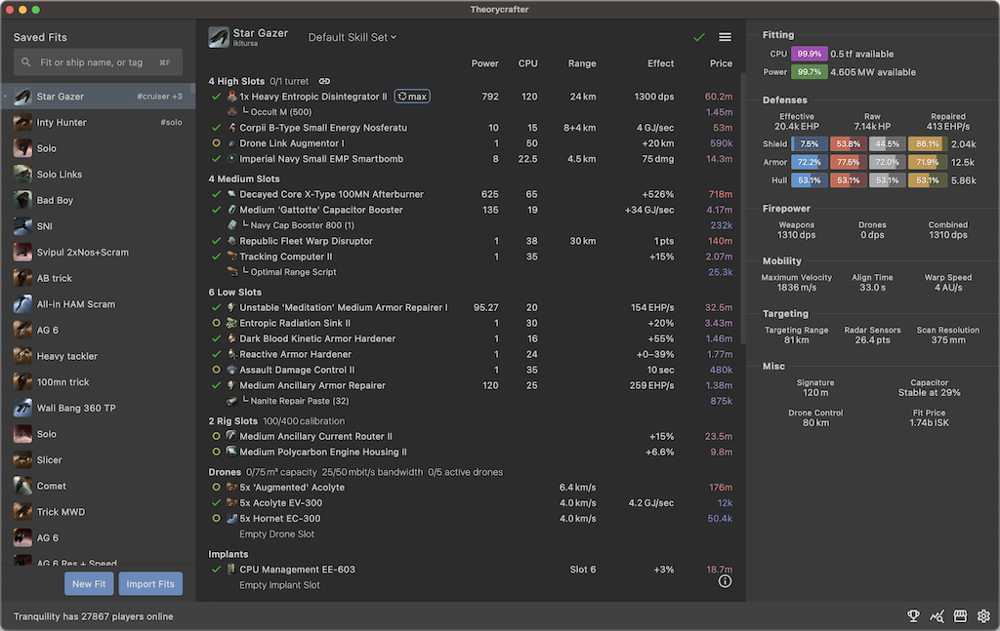

---
search:
  exclude: true

title: Theorycrafter
type: service
description: Theorycrafter is a next-gen fitting tool for ships in Eve Online – it aims to be fast, ergonomic and intuitive.
maintainer:
  name: Faffywaffy
  github: m-sasha
---

# Theorycrafter

Theorycrafter is a next-gen fitting tool for ships in Eve Online – it aims to be fast, ergonomic and intuitive.

- [:octicons-browser-16: **Website**](https://theorycrafter.pro/){ .esi-card-link }
- [:simple-discord: **Discord**](https://discord.gg/nVhkgbrGzs){ .esi-card-link }

