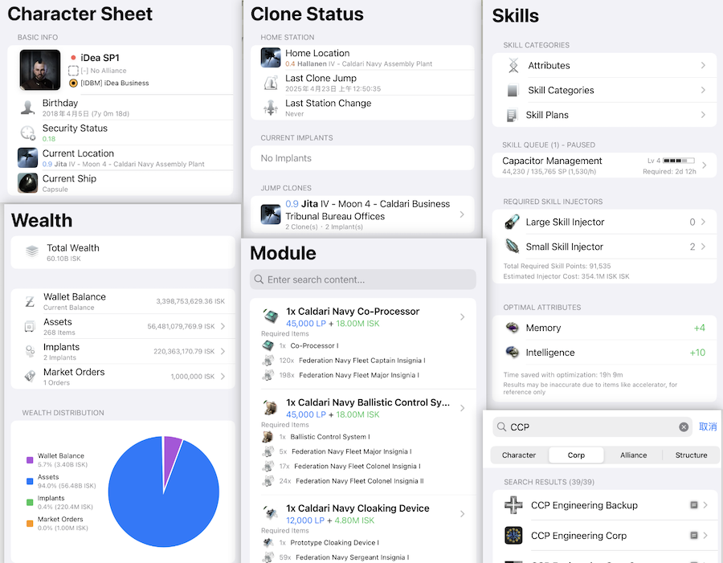
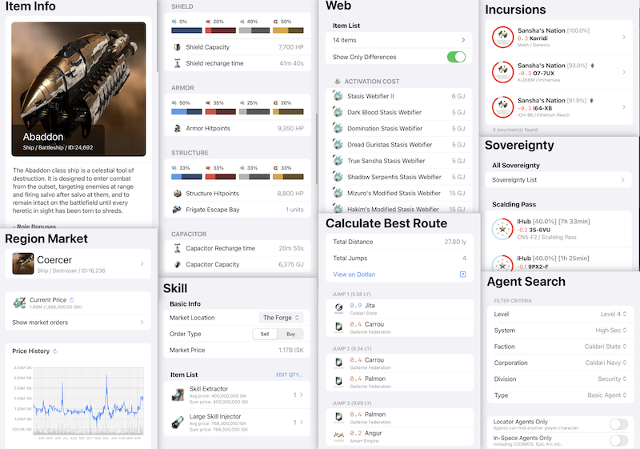
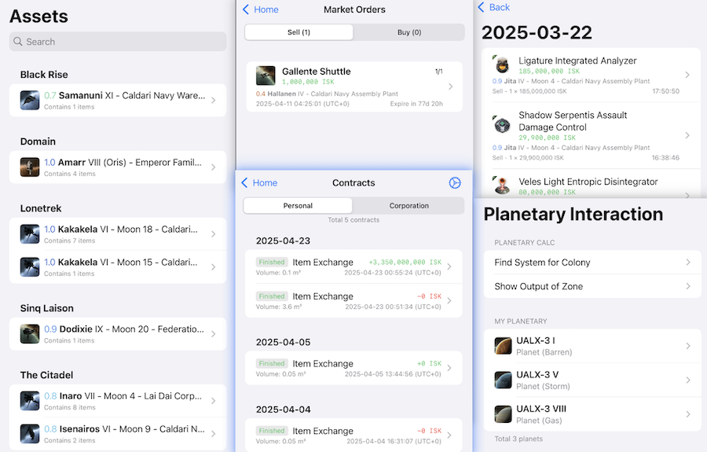
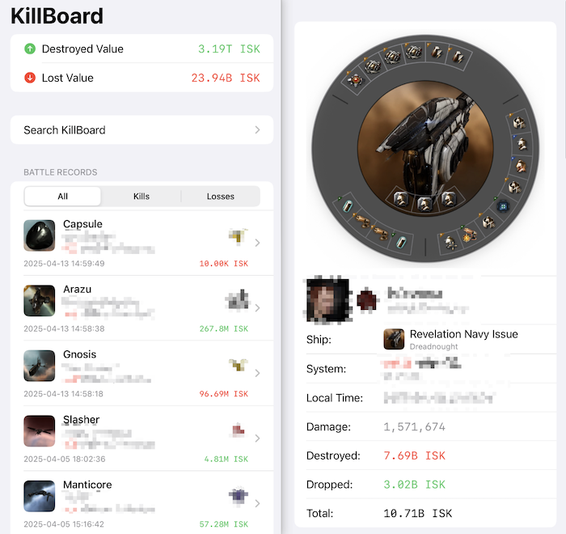

---
search:
  exclude: true

title: Tritanium
type: service
description: EVE Online的iOS应用。显示资产、技能、行星开发、市场、数据库、邮件、忠诚点数、工业等信息。
maintainer:
  name: EstamelGG
  github: EstamelGG
---

# Tritanium

EVE Online的iOS应用。展示玩家资产、技能、行星开发、市场、数据库、邮件、忠诚点数、工业等信息。

应用支持 **中文**、**英文**。

页面语言:

- [中文](index_cn.md)
- [English](index.md)

- [:octicons-device-mobile-16: __App Store__](https://apps.apple.com/cn/app/tritanium/id6739530875){ .esi-card-link }
- [:octicons-mark-github-16: __仓库__](https://github.com/EstamelGG/EVE-Nexus){ .esi-card-link }

# 功能总览

**Tritanium** 提供多种信息和功能，并实现了丰富的本地化改进：

- 角色信息
- 技能浏览器
- 克隆浏览器
- 收发邮件
- 查看资产
- 忠诚点数与忠诚点商店
- 搜索角色\公司\联盟\建筑
- 市场订单
- 属性比较
- NPC信息
- 代理人搜索器
- 虫洞信息
- 萨沙入侵
- 主权争夺
- 多语言搜索
- 旗舰跳跃导航
- 查看合同与快递模式
- 钱包记录与交易记录
- 工业和采矿
- 行星工业
- 公司建筑监视器和月矿监视器
- 击杀榜
- 更多... 

# 人物表单

# 数据库

# 商业信息

# 击杀榜

