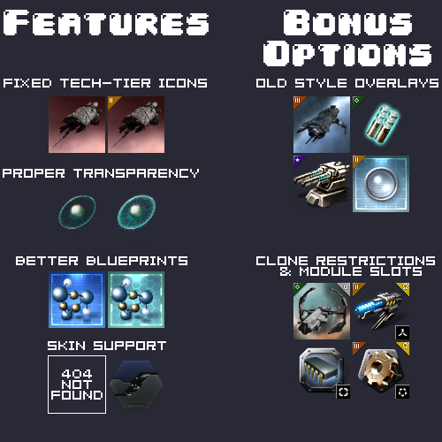

---
search:
  exclude: true

title: Turtle's Alternate Icons
type: resource
description: Alternate item icon set
maintainer:
  name: SentientTurtle
  github: sentientturtle
---

# Turtle's Alternate Icons

A set of alternate item & ship icons, fixing various issues with the official [Image Service](../../services/image-server/index.md).

Status of those problems is tracked on the ['esi-issues' issue-tracker.](https://github.com/esi/esi-issues/issues/1448) If the issue has been resolved (closed), consider using the official Image Service.  

- [:octicons-download-16: __Download__](https://github.com/SentientTurtle/EVE-TurtleTools/releases){ .esi-card-link }
- [:octicons-mark-github-16: __GitHub__](https://github.com/SentientTurtle/EVE-TurtleTools){ .esi-card-link }

## Features

* All 'static' icons for items (Icons in 64x64 pixel PNG format, and 512x512 pixel ship/structure/etc 'renders' as JPG)
    * Character Avatars, Corporation Logos, and Alliance Logos change dynamically. The Image Service must be used for those.
    * Fixes for broken icons
    * Support for SKIN icons
* Two format options:
    * Easy to use format matching the (deprecated) 'Image Export Collection'
        * Single zip file with image files for all types; `[TYPE_ID]_64.png` & (where applicable) `[TYPE_ID]_512.jpg`
    * Compact 'Service Bundle' with de-duplicated icons & JSON metadata
* Bonus options:
    * Old style 'glossy' overlays
    * Extra overlays for Alpha-Clone or Omega-Clone requirements
    * Extra overlays for module slots (As shown in the in-game market browser)
* Automatic updates via GitHub Releases

