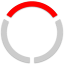

---
search:
  exclude: true

title: Upwell.gg
type: service
description: Share structure timers and pings with your alliance, corporation, and allies.
maintainer:
  name: Tujiko Noriko
  github: nfinished
---

# Upwell.gg

Share structure timers and pings with your alliance, corporation, and allies.

- [:octicons-browser-16: __Website__](https://upwell.gg){ .esi-card-link }
- [:simple-discord: __Discord__](https://discord.gg/Ng5ZsyvYzK){ .esi-card-link }

## Features

- **Structure Timers**: Share structure timers with your groups and never miss a timer with integrated Discord pings.
- **Pings**: Share pings across groups to notify multiple Discord servers and channels at once.
- **Groups**: Create groups for your alliance, corporation, or coalition with strict access controls and permissions.
