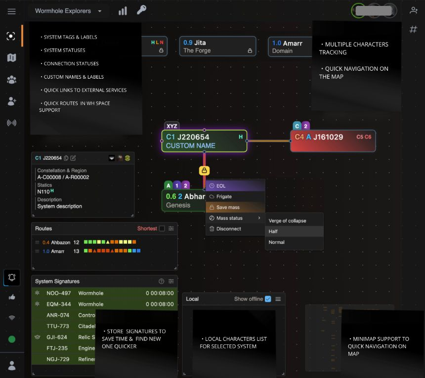

---
search:
  exclude: true

title: Wanderer
type: service 
description: Wanderer is an EVE Online mapper tool, light and fast alternative to Pathfinder. You can self-host Wanderer Community Edition or have us manage Wanderer for you in the cloud.
maintainer:
  name: Wanderer Industries 
  github: wanderer-industries
---

# `Wanderer - Mapping Tool`

Wanderer is an EVE Online mapper tool, light and fast alternative to Pathfinder. You can self-host Wanderer Community Edition or have us manage Wanderer for you in the cloud.

- [:octicons-browser-16: __Website__](https://wanderer.ltd/){ .esi-card-link }
- [:simple-discord: __Discord__](https://discord.gg/t4f4hJD4){ .esi-card-link }
- [:simple-gitlab: __GitHub__](https://github.com/wanderer-industries){ .esi-card-link }

# Wanderer

[Wanderer](https://wanderer.ltd/) is an EVE Online mapper tool, light and fast alternative to Pathfinder. You can self-host Wanderer Community Edition or have us manage Wanderer for you in the cloud. Made and hosted in the EU 🇪🇺

## Why Wanderer?

Here's what makes Wanderer a great Pathfinder alternative:

- **Clutter Free**: Wanderer provides simple interface and it cuts through the noise. No training necessary.
- **Lightweight, fast and secure**: Wanderer is lightweight and fast. It uses a self-hosted database and a self-hosted server.
- **See all your characaters on a single page**: Wanderer provides a simple interface to see all your characters on a single page.
- **SPA support**: Wanderer is built with modern web frameworks in core.
- **Active development**: Wanderer is actively developed and improved with new features and updates every week based on user feedback.

Interested to learn more? [Check more on our website](https://wanderer.ltd/news).

### Can Wanderer be self-hosted?

Wanderer is [open source](https://wanderer.ltd/open-source-website-analytics) and we have a free as in beer and self-hosted solution called [Wanderer Community Edition (CE)](https://wanderer.ltd/news/self-hosted). Here are the differences between Wanderer and Wanderer CE:

|  | Wanderer Cloud  | Wanderer Community Edition |
| ------------- | ------------- | ------------- |
| **Infrastructure management** | Easy and convenient. It takes 2 minutes to register your character and create a map. We manage everything so you don’t have to worry about anything and can focus on gameplay. | You do it all yourself. You need to get a server and you need to manage your infrastructure. You are responsible for installation, maintenance, upgrades, server capacity, uptime, backup, security, stability, consistency, loading time and so on.|
| **Release schedule** | Continuously developed and improved with new features and updates multiple times per week. | Latest features and improvements won't be immediately available.|
| **Server location** | All visitor data is exclusively processed on EU-owned cloud infrastructure. We keep your site data on a secure, encrypted and green energy powered server in Germany. This ensures that your site data is protected by the strict European Union data privacy laws and ensures compliance with GDPR. Your website data never leaves the EU. | You have full control and can host your instance on any server in any country that you wish. Host it on a server in your basement or host it with any cloud provider wherever you want, even those that are not GDPR compliant.|

Interested in self-hosting Wanderer CE on your server? Take a look at our [Wanderer CE installation instructions](https://github.com/wanderer-industries/community-edition/).

Wanderer CE is a community supported project and there are no guarantees that you will get support from the creators of Wanderer to troubleshoot your self-hosting issues. There is a [community supported forum](https://github.com/orgs/wanderer-industries/discussions/4) where you can ask for help.

Our only source of funding is your donations.

## Technology

Wanderer is a standard Elixir/Phoenix application backed by a PostgreSQL database for general data. On the frontend we use [TailwindCSS](https://tailwindcss.com/) for styling and React to make the map interactive.
