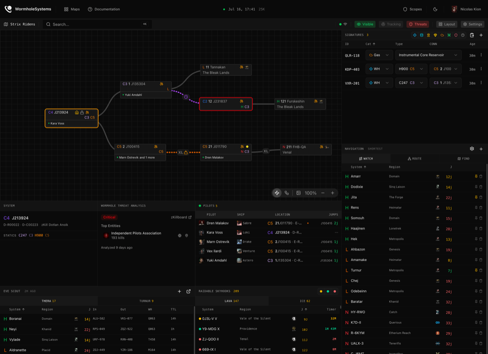
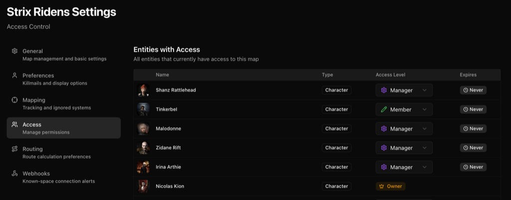

---
search:
  exclude: true

title: WormholeSystems
type: service
description: Live, collaborative wormhole mapping for EVE Online. Open source, with smart routing, intel, and Discord alerts.
maintainer:
  name: WormholeSystems Team
  github: WormholeSystems
---

# WormholeSystems

{ width="128" }

WormholeSystems is a live, collaborative map for wormhole space. Your whole corp works on the same picture of the chain, and every change appears for everyone in real time.

[](https://github.com/WormholeSystems/WormholeSystems/blob/main/LICENSE)
[](https://github.com/WormholeSystems/wormholesystems-cli)
[](https://github.com/WormholeSystems/wormholesystems-containers)

<div class="grid cards" markdown>

- [:octicons-browser-16: **Website**](https://wormhole.systems){ .esi-card-link }
- [:octicons-book-16: **Documentation**](https://wormhole.systems/documentation){ .esi-card-link }
- [:simple-discord: **Discord**](https://discord.gg/rpfWCzVJS7){ .esi-card-link }
- [:simple-github: **GitHub**](https://github.com/WormholeSystems){ .esi-card-link }

</div>

## Mapping

Systems are nodes, wormholes are the connections between them. You can add systems by hand, or let the app map as you fly: with location tracking enabled, it notices your jumps, asks which signature you went through, and draws the new system and connection for you. Disconnected leftovers are cleaned up automatically, pinned systems stay put, and an ignore list keeps trade hubs off the map.



*A mapped chain, with signatures, navigation, threat analysis, and pilot tracking alongside.*

## Signatures and mass

Paste your probe scanner output into the signatures panel and the app reconciles it with what is already recorded, showing what is new, updated, or gone before anything is saved. Wormhole connections track lifetime, remaining mass, and maximum ship size. Members can log jumps through a hole, and the app estimates the mass it has left.

## Routing

The route planner combines stargates, your mapped wormholes, and optionally EVE Scout's public Thera and Turnur connections. Filters exclude holes by lifetime and mass, and a preference setting weighs shorter routes against safer ones. Finished routes can be sent to the in-game autopilot, for one character or all your connected ones. A watch list shows live jump counts to systems you care about, and shared home system and rally point markers keep the group oriented.

## Intel

A live feed from zKillboard shows kills in and around the chain, and 90 days of kill history give every wormhole system a threat rating, visible directly on the map. Discord alerts can notify your server when a system comes within a set number of jumps of the chain, when kills happen nearby, or when a new exit puts a target system within capital jump range, configurable by ship class and jump skills.

## Access

Access is granted per map to characters, corporations, or alliances, and every grant can carry an expiration date. A user's level is the highest of all entries matching their character, corporation, and alliance.

| Action                                     | Viewer | Member | Manager | Owner |
| ------------------------------------------ | :----: | :----: | :-----: | :---: |
| View systems, connections, and signatures  |   ✓    |   ✓    |    ✓    |   ✓   |
| See live character positions               |        |   ✓    |    ✓    |   ✓   |
| Edit the map (systems, signatures, chain)  |        |   ✓    |    ✓    |   ✓   |
| Manage access and share links              |        |        |    ✓    |   ✓   |
| Delete the map                             |        |        |         |   ✓   |

Maps can also be made public or shared through a revocable guest link; both are read-only and never show live character positions.



*Managing who has access to a map, at which level, and until when.*

## Customization

Panels for signatures, kills, routing, intel, and more can be rearranged, resized, or hidden, and a finished layout can be copied as text and shared with corpmates. Per-map bookmark naming templates keep in-game bookmarks consistent across the corp, and a `Cmd+K` command palette searches systems, threats, and notes.

## Open source and self-hosting

WormholeSystems is MIT-licensed and developed on [GitHub](https://github.com/WormholeSystems). The hosted service exposes a REST API with personal access tokens, and a self-hosted instance is one command away:

```bash
curl --proto '=https' --tlsv1.2 -sSf https://install.wormhole.systems | sh
```

This installs the `wsctl` CLI, whose setup wizard handles the whole Docker stack: configuration, secrets, SSL, and database initialization including the EVE static data. The server needs git and Docker with Compose v2.24 or newer, and for production a domain pointing at it with ports 80 and 443 open. You also need an [EVE developer application](https://developers.eveonline.com/); the wizard tells you how to configure its callback URL and scopes. A login allowlist can restrict a private instance to your own corp or alliance.
