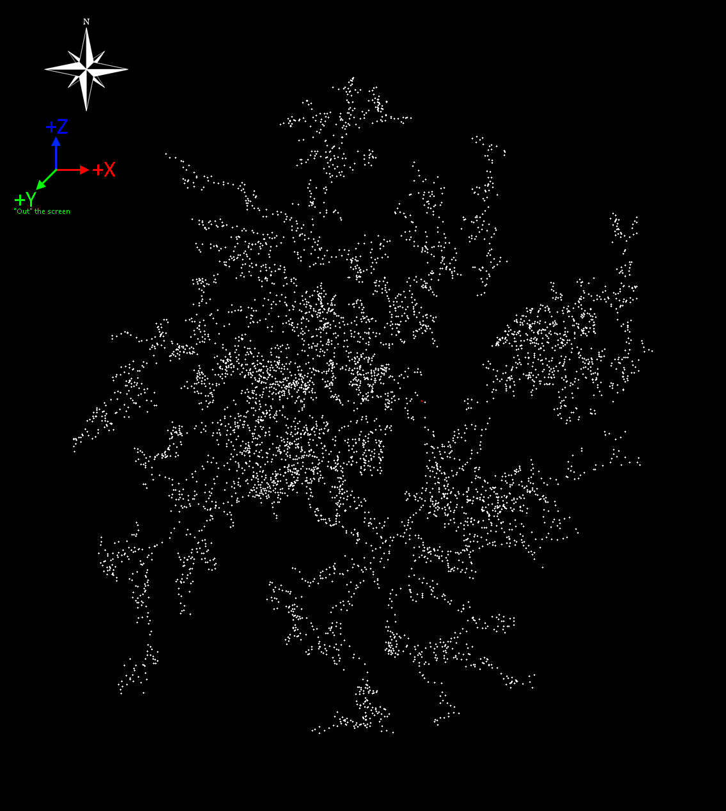
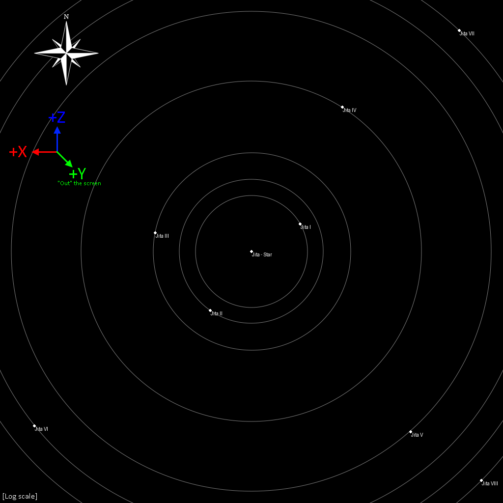
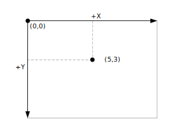

# Map Data

## General Information

Map data is available in the [SDE](../../services/sde/index.md) or through [ESI](../../services/esi/overview/).  
Objects like regions, constellations, solarsystems, planets, moons, and other celestial bodies have a position.

There are two kinds of position, each using their own coordinate system:  

* Relative to the center of the New Eden cluster. (Used by regions, constellations, solarsystems)  
  The center of the cluster lies near Zarzakh, labelled "Point of No Return" on the in-game map. (See the red dot on the cluster map below)  

* Relative to the center of a solarsystem. (used by planets, moons, stars, as well as other positions within a solarsystem such as killmails)  
  The center of a solarsystem is it's star. Not every solarsystem has a star object; for abyssal deadspace systems with neither star nor planet, the origin is an arbitrary point.
  Note: The star objects themselves do not have an explicit position in the SDE or ESI, as their position is always `[0.0, 0.0, 0.0]`.  

These coordinate systems have the same scale (1.0 = 1 meter), but different directions.  

## Universe

All region (& constellations, solarsystems) share a single coordinate system. This includes the data for abyssal, wormhole-space, and void regions, though only the 'New Eden' solarsystems (`SolarSystemID` in the range `30,000,000 to 30,999,999`) are included on the in-game map.

The SDE organizes regions into folders by kind:

* `/abyssal/`: Abyssal Deadspace, entered through abyssal filaments. (Not to be confused with Pochven)  
* `/eve/`: The New Eden Cluster, the main space of the game; Highsec, Lowsec, Nullsec. (Including Pochven)  
* `/void/`: Void Regions. Used for the tutorial & certain events.  
* `/wormhole/`: Wormhole Space.  
(The SDE also contains a `/landmarks/` folder, which contains landmark information but not regions)

In ESI, the endpoints return data for all regions/constellations/systems.  
For both SDE and ESI, different kinds of space can be identified through [ID ranges](../../guides/id-ranges.md).

### Map

When displayed by the in-game map & most community maps, the mapping convention is to look "top down" oriented with the region of 'Venal' at the top as a fake "Space North". In this orientation, the coordinates have the following directions:

* `+X` is East/Right, `-X` is West/Left.
* `+Y` is Up, `-Y` is Down.
* `+Z` is North/Forward, `-Z` is South/Backward

Note: This forms a **Left**-Handed coordinate system. If you are using a 3D graphics or geometry library, it may expect either Left- or Right-Handed coordinates. Using incorrect handedness results in a 'mirrored' image. You can convert handedness by negating a single axis. (e.g. `[X, Y, -Z]`)

Note on SDE data:  
Regions, constellations, and solarsystems each have  `max` and `min` fields denoting approximate bounding-boxes. These use a different coordinate system to the position field: The minimum and maximum `Z` values are negated. As-is the values are incorrect, and in most cases the `Z` position will not be in the range `Z_min to Z_max`, there are two workarounds:

* Negate and swap z-axis `min` and `max` values; `Z_min, Z_max = -Z_max, -Z_min`
* Negate z coordinate in positions; `Z_min < -z < Z_max` (This changes the coordinate system described above, resulting in '+Z' pointing southwards)

## Solarsystem

Each individual solar system in the game has its own isolated coordinate system, with planets & other celestial objects having their positions given relative to the star.

When matching the 'Space North' orientation as used by the in-game map (see above), the coordinate system is as follows:

In this orientation, the coordinates have the following directions:

* `+X` is West/Left, `-X` is East/Right.  
* `+Y` is Up, `-Y` is Down.
* `+Z` is North/Forward, `-Z` is South/Backward.

Note: This is different with the Universe's coordinate system, and is **Right**-Handed.

### Combining the coordinate systems

Both coordinate systems have the same scale but different axes. To get the position of a planet within the larger 'universe' coordinate system, it's position can be added to that of the parent star with the x coordinate negated:  
x = xsystem - xplanet  
y = ysystem + yplanet  
z = zsystem + zplanet

Caution: 32-bit floating point numbers do not have enough precision to handle both the 'large' scale of the interstellar distances and the 'small' scale of interplanetary distances. This results in a loss of precision and graphical glitches on objects distant from the origin.  
This problem can be mitigated by either using 64-bit floating point numbers or by using "Floating Origin" techniques.

## Example: 2D map

To draw a 2D map of the universe, the 3D coordinates need to be transformed into 2D positions on an image. The transformation required varies depending on the coordinate system used by the image.

This example uses the common "top-left origin" coordinate system widely used in images & 2D graphics. Here the `(0,0)` origin lies in the top-left corner of the image, the X axis points right and the Y axis points **down**.

These image axes map onto the axes of the universe data as follows:

* Ximg = Xeve
* Yimg = -Zeve
* The Yeve coordinate is discarded to flatten the map vertically.

After this, the coordinates must be moved and resized to fit within the image canvas. This can be done by calculating a bounding box, subtracting the position of the top-left corner of the bounding box from each coordinate, then dividing by width or height of the bounding box. This yields a position in the range 0 to 1, which can then be multiplied by the image width or height to get a final pixel position.

--8<-- "snippets/examples/map-2d-cluster.md"

A 2D solarsystem map can be drawn through the same approach, but as the X-axis points in the opposite direction for celestial body coordinates, both the Xeve and Zeve are negated:

* Ximg = -Xeve
* Yimg = -Zeve

Tip: Use logarithmic scaling for image maps of solarsystems, as the distances between objects span several orders of magnitude.
