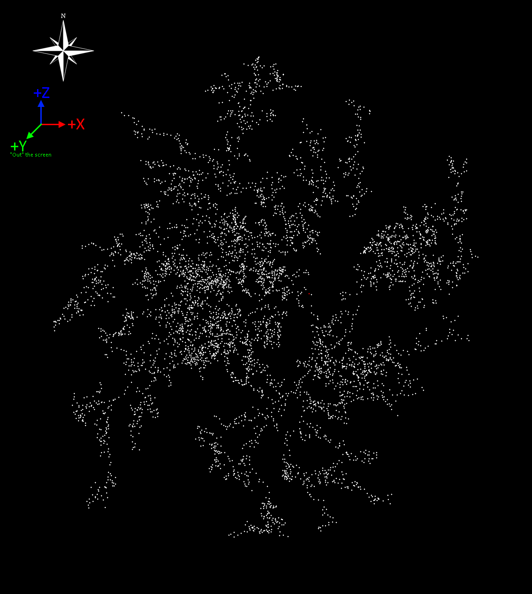
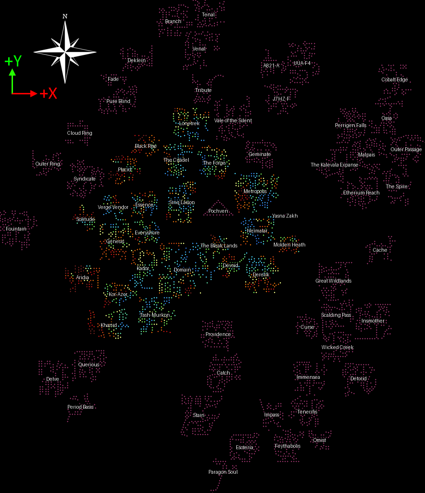
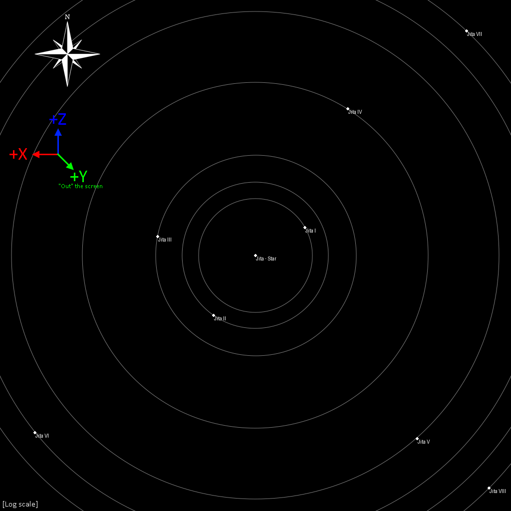
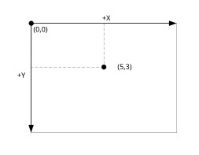

# Map Data

## General Information

Map data is available in the [SDE](../../services/static-data/index.md) or through [ESI](../../services/esi/overview.md).
Objects like regions, constellations, solarsystems, planets, moons, and other celestial bodies have a position.

There are two kinds of position, each using their own coordinate system:

* Relative to the center of the New Eden cluster. (Used by regions, constellations, solarsystems)<br>
  The center of the cluster lies near Zarzakh, labelled "Point of No Return" on the in-game map. (See the red dot on the cluster map below)<br>
  For systems in the New Eden Cluster both a 'geographic' position and a 'schematic' position ("position2D") is provided. The former is the actual position of the solarsystem, used for jump range calculations and the in-game 3D map. The latter is used for the in-game 2D map.

* Relative to the center of a solarsystem. (used by planets, moons, stars, as well as other positions within a solarsystem such as killmails)<br>
  The center of a solarsystem is it's star. The star objects themselves do not have an explicit position in the SDE or ESI, as their position is always `[0.0, 0.0, 0.0]`<br>
  Not every solarsystem has a star object; for abyssal deadspace systems with neither star nor planet, the origin is an arbitrary point.

These coordinate systems have the same scale (1.0 = 1 meter), but different directions.

## Universe

All regions, constellations, and solarsystems share a single coordinate system.

The SDE contains map data in the `map`-prefixed files, such as `mapRegions`, `mapConstellations`, and `mapSolarSystems`.
ESI provides this data through endpoints under the `/universe/` such as [`/universe/regions/`](/api-explorer#/operations/GetUniverseRegions).

For both SDE and ESI, data is provided for all kinds ('known space', 'wormhole space', 'abyssal space') of space. Different kinds of space can be identified by the [ID ranges](../../guides/id-ranges.md) for the regionID, constellationID or solarSystemID.
Only the 'New Eden' solarsystems (`SolarSystemID` in the range `30,000,000 to 30,999,999`) are included on the in-game map.

### Map

When displayed by the in-game map & most community maps, the mapping convention is to look "top down" oriented with the region of 'Venal' at the top as a "Space&nbsp;North". In this orientation, the coordinates have the following directions:

* `+X` is East/Right, `-X` is West/Left.
* `+Y` is Up, `-Y` is Down.
* `+Z` is North/Forward, `-Z` is South/Backward

!!! note

    This forms a **Left**-Handed coordinate system. If you are using a 3D graphics or geometry library, it may expect either Left- or Right-Handed coordinates. Using incorrect handedness results in a 'mirrored' image which rotations alone cannot correct. You can convert handedness by negating a single axis. (e.g. `[X, Y, -Z]`)



### 2D 'schematic' Map

The 2D 'schematic' positions follow the same conventions, with the position2D `X` coordinate pointing in the same direction as the 3D position `X` coordinate, and position2D `Y` coordinate pointing in the same direction as the 3D position `Z` coordinate.



### Route calculation

See [Route Calculation](../route-calculation.md) for details how to calculate a route in New Eden.

### Jump drives

Unlike stargate connections, jump drives can reach any valid system within range in a single jump. Jump drives allow jumping *to* any low- and nullsec system, with the exclusion of Pochven and the Jove regions. Ships can also jump *from* high-sec space into low- or nullsec.
Jump drive range is determined by the ship the player is piloting and their 'Jump Drive Calibration' skill.

A graph can be built by linking each solarsystem to every other solar system that may be jumped to.
For a given system<sub>1</sub> and system<sub>2</sub> and their positions (x, y, z), the systems are in jump range if:

$\sqrt{\left(x_1-x_2\right)^2+\left(y_1-y_2\right)^2+\left(z_1-z_2\right)^2}\le\ (Jump\ range\ in\ LY\ \ast\ {9\,460\,000\,000\,000\,000.0})$

!!! warning "Caution"

    For the purposes of jump drive range calculation, a single lightyear is exactly `9,460,000,000,000,000.0` (9.46 × 10^15) meters, slightly less than the real world scientific definition of a lightyear.
    Using the incorrect value may cause routes to include impossible jumps.


## Solarsystem

Each individual solar system in the game has its own isolated coordinate system, with planets & other celestial objects having their positions given relative to the star.

When matching the 'Space North' orientation as used by the in-game map (see above), the coordinate system is as follows:

In this orientation, the coordinates have the following directions:

* `+X` is West/Left, `-X` is East/Right.
* `+Y` is Up, `-Y` is Down.
* `+Z` is North/Forward, `-Z` is South/Backward.

!!! note

    This is different to the Universe's coordinate system, and is **Right**-Handed.



### Combining the coordinate systems

Both coordinate systems have the same scale but different axes. To get the position of a planet within the larger 'universe' coordinate system, it's position can be added to that of the parent star with the x coordinate negated:
x = x<sub>system</sub> - x<sub>planet</sub>
y = y<sub>system</sub> + y<sub>planet</sub>
z = z<sub>system</sub> + z<sub>planet</sub>

!!! note "Note: Floating point precision"

    32-bit floating point numbers do not have enough precision to handle both the 'large' scale of the interstellar distances and the 'small' scale of interplanetary distances when combining the position of stars and the celestial bodies orbiting them as described above.

    This problem can be mitigated by using 64-bit "double precision" floating point numbers.

    In 3D rendering or other situations where 64-bit numbers are unavailable, "Floating Origin" techniques can also mitigate this problem.

### Orbit paths

The SDE gives each celestial's current position and its parent (`orbitID`: planets orbit the star, moons orbit their planet), but it does not say which plane an orbit lies in. A position and a centre fix the radius of the orbit, but any circle about the parent that passes through the child is equally valid.

The in-game map picks one of those circles with a fixed rule, and following the same rule makes your orbit lines match what players see:

1. Start with a circle of radius $R$ in the XZ plane, centred on the origin and passing through $(-R, 0, 0)$.
2. Rotate it by the shortest-arc rotation that turns the unit vector $(-1, 0, 0)$ onto the direction from the parent to the child.
3. Translate it to the parent's position.

Because of this, the tilt of each ring is an artefact of the rule rather than physical data. Bodies on the parent's `+X` side get the largest tilts. The `orbitRadius` and `eccentricity` values in the SDE's celestial statistics don't describe this ring, so draw a plain circle through the body's current position.

#### The math

For a parent at $\vec{P}$ and a child at $\vec{C}$:

$$
\vec{d} = \vec{C} - \vec{P}, \qquad R = |\vec{d}|, \qquad \hat{u} = \frac{\vec{d}}{R} = (u_x, u_y, u_z)
$$

$\hat{u}$ is the first axis of the ring's plane. The second axis $\hat{v}$ is $(0, 0, 1)$ turned by the same rotation that takes $(-1, 0, 0)$ onto $\hat{u}$. You can build that rotation as a quaternion around the axis $(-1,0,0) \times \hat{u} = (0, u_z, -u_y)$ by the angle $\arccos(-u_x)$, or you can use the closed form:

$$
\hat{v} = \left(u_z,\ \ -\frac{u_y u_z}{1 - u_x},\ \ 1 - \frac{u_z^2}{1 - u_x}\right)
$$

$\hat{v}$ is a unit vector perpendicular to $\hat{u}$. For any angle $\theta$, a point on the ring is:

$$
\vec{p}(\theta) = \vec{P} + R\left(\hat{u}\cos\theta + \hat{v}\sin\theta\right)
$$

At $\theta = 0$ this gives exactly $\vec{C}$, so the line always passes through the body. To draw the ring, step $\theta$ from $0$ to $2\pi$ and connect the points as a line strip. The normal of the orbital plane, if you need it, is $\hat{u} \times \hat{v}$.

!!! note "Edge cases"

    * If $u_x = 1$ (the child is directly on the parent's `+X` side), the formula divides by zero. The two directions point opposite ways, so any 180° rotation works. Rotate around the Y axis to get $\hat{v} = (0, 0, -1)$.
    * If $u_x = -1$, no rotation is needed and $\hat{v} = (0, 0, 1)$. The closed form handles this case without special code.
    * Numerically, test $1 - u_x$ against a small epsilon rather than comparing to exactly zero.

#### Worked example: Jita IV

Jita IV (`40009082`) orbits the star Jita (`40009076`, at the origin):

| | Value |
|---|---|
| $\vec{P}$ (star) | $(0,\ 0,\ 0)$ |
| $\vec{C}$ (planet) | $(-107\,354\,576\,606,\ -18\,753\,785\,170,\ 436\,797\,007\,078)$ |
| $R$ | $450\,187\,000\,000$ m (≈ 3.009 AU) |
| $\hat{u}$ | $(-0.238467,\ -0.041658,\ 0.970257)$ |
| $1 - u_x$ | $1.238467$ |
| $\hat{v}$ | $(0.970257,\ 0.032636,\ 0.239868)$ |

Checking the values: $\hat{u} \cdot \hat{v} = 0$ and $|\hat{v}| = 1$. Sample points around the ring:

| $\theta$ | $\vec{p}(\theta)$ (m) |
|---|---|
| 0° | $(-107\,354\,576\,606,\ -18\,753\,785\,170,\ 436\,797\,007\,078)$, which is Jita IV itself |
| 90° | $(436\,797\,007\,078,\ 14\,692\,352\,243,\ 107\,985\,389\,577)$ |
| 180° | $(107\,354\,576\,606,\ 18\,753\,785\,170,\ -436\,797\,007\,078)$ |
| 270° | $(-436\,797\,007\,078,\ -14\,692\,352\,243,\ -107\,985\,389\,577)$ |

The plane normal $\hat{u} \times \hat{v} \approx (-0.0417,\ 0.9986,\ 0.0326)$, so this ring is tilted about 3.03° from the XZ plane.

```python
import math

def orbit_ring(parent, child, segments=128):
    """Points of the orbit ring through `child`, centred on `parent` (both [x, y, z])."""
    d = [c - p for c, p in zip(child, parent)]
    R = math.sqrt(sum(x * x for x in d))
    ux, uy, uz = (x / R for x in d)

    k = 1.0 - ux
    if k < 1e-12:                      # child is on the parent's +X side
        v = (0.0, 0.0, -1.0)
    else:
        v = (uz, -uy * uz / k, 1.0 - uz * uz / k)

    u = (ux, uy, uz)
    points = []
    for i in range(segments + 1):      # +1 closes the loop
        t = 2 * math.pi * i / segments
        c, s = math.cos(t) * R, math.sin(t) * R
        points.append([parent[j] + u[j] * c + v[j] * s for j in range(3)])
    return points
```

!!! tip

    Every orbit ring shares the precision problem described above: a moon's ring may be only tens of thousands of km across while sitting hundreds of millions of km from the star. Subtract the camera (or parent) position in 64-bit *before* converting the ring's points to 32-bit floats for the GPU.


## Example: 3D map rendered as an image

To draw a map of the universe, the 3D coordinates need to be transformed into 2D positions on an image. The transformation required varies depending on the coordinate system used by the image.

This example uses the common "top-left origin" coordinate system widely used in images & 2D graphics. Here the `(0,0)` origin lies in the top-left corner of the image, the X axis points **right** and the Y axis points **down**.



These image axes map onto the axes of the universe data as follows:

* X<sub>img</sub> = X<sub>eve</sub>
* Y<sub>img</sub> = -Z<sub>eve</sub>
* The Y<sub>eve</sub> coordinate is discarded to flatten the map vertically.

After this, the coordinates must be moved and resized to fit within the image canvas. This can be done by calculating a bounding box, subtracting the position of the top-left corner of the bounding box from each coordinate, then dividing by width or height of the bounding box. This yields a position in the range 0 to 1, which can then be multiplied by the image width or height to get a final pixel position.

--8<-- "snippets/examples/map-cluster.md"

The 2D "schematic" positions can be used similarly, with the 3D `Z` coordinate replaced by the 2D `Y` coordinate:

* X<sub>img</sub> = X<sub>eve</sub>
* Y<sub>img</sub> = -Y<sub>eve</sub>

A solarsystem map uses different axes; The X-axis points in the opposite direction for celestial body coordinates, both the X<sub>eve</sub> and Z<sub>eve</sub> are negated:

* X<sub>img</sub> = -X<sub>eve</sub>
* Y<sub>img</sub> = -Z<sub>eve</sub>

!!! tip

    Use logarithmic scaling for maps of solarsystems, as the distances between objects span several orders of magnitude.
