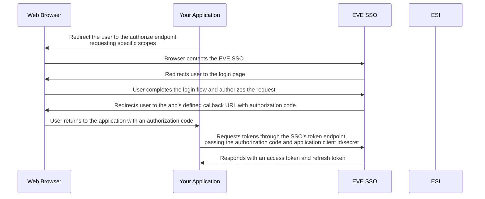
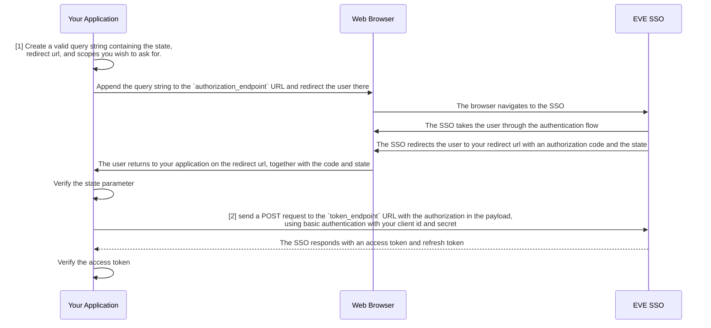
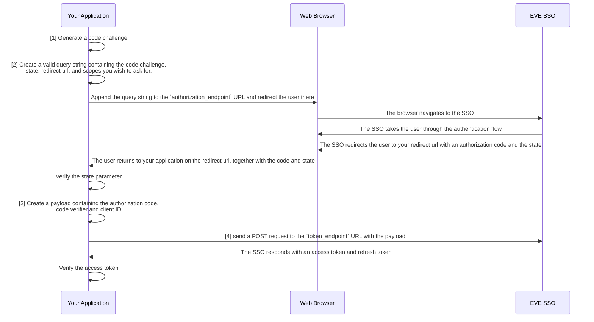

# Single Sign-On (SSO)

The EVE Single Sign-On (SSO) Service helps facilitate third-party application access for players.
By leveraging the OAuth 2.0 protocol, the EVE SSO allows players to sign in to external websites, applications or tools using their EVE Online credentials.
Furthermore, this provides a seamless and secure way for players to authorize third-party applications to access their EVE Online data through the ESI API, without exposing their account credentials.

The SSO ensures that third-party applications can obtain limited access to a character's data based on the permissions granted (also known as "scopes").
For instance, a third-party application may request access to a character's location, skill queue or wallet balance, but only if the player explicitly grants the application permission to do so.
At the same time, scopes not granted by the player will not be accessible to the third-party application.

This secure, token-based access control mechanism ensures that players have full control over the data they share with third-party applications, and can revoke access at any time.

## How it works

The EVE SSO workflow is based on the OAuth 2.0 protocol, which is a widely used standard for secure authorization.

To explain the SSO workflow roughly, we will use the example of a third-party website that wants to access a player's character data.

1. **Application Registration**: Before using the SSO, developers must register their application with the EVE Online Developers Portal.
   This process generates a unique client ID and secret, which are used to authenticate the application with the SSO service.
2. **Authorization Request**: When a user wants to use a third-party application, the application redirects the user to the EVE SSO service.
   The user is prompted to log in with their EVE Online account, after which they select with which character they wish to continue, and to confirm the access scopes that will be granted to the application. The user must explicitly consent to all the requested scopes, or cancel the process.
3. **Authorization Code and Redirect**: If the user has selected a character, and consented to the requested scopes, the SSO service redirects the user back to the third-party application.
   The redirect contains an authorization code, which the application can use to obtain an access token.
4. **Token Exchange**: The third-party application sends the authorization code to the SSO service, along with the client ID and secret. In return, the SSO service returns an access token together with a refresh token.
   The access token is a time-limited token used to authenticate requests to the ESI API, while the refresh token can be used to obtain a new access token when the current one expires.
5. **Accessing the ESI API**: With the access token, the third-party application can now make requests to the ESI API on behalf of the user. The token is valid only for the character and scopes that the user has consented to, and until it expires.

## Terms and important notes

- **Client ID and Secret**: The client ID and secret are used to authenticate the application with the SSO service.
   The Client ID is public and can be shared, but the secret must be kept private.
- **Scopes**: Scopes are permissions that the user must grant to the application.
   The application can only access the data that the user has consented to.
   Applications can also only request scopes that they have assigned in the application registration.
- **Access Token**: The access token is a time-limited token that the application uses to authenticate requests to the ESI API.
   The token is only valid for the character and scopes that the user has consented to.
- **Refresh Token**: The refresh token is used to obtain a new access token when the current one expires.
   The refresh token is long-lived and can be used to obtain new access tokens indefinitely, as long as the user has not revoked the application's access.
   This token must be kept secure, as it can be used to obtain new access tokens.
- **Authorization Code**: The authorization code is a one-time code that the application exchanges for an access token.
   The code is only valid for a short period and can only be used once.
- **Redirect URLs**: The application must define a redirect URL where the user is sent after completing the authorization flow.
   The redirect URL must be registered with the application. Any other URL will be rejected by the SSO service.
- **State Parameter**: The state parameter is used to prevent CSRF attacks.
   The application generates a random string and includes it in the authorization request.
   The SSO service returns the same string in the redirect, and the application must verify that the state parameter matches the one it sent.
- **Endpoints**: The SSO service has several endpoints that applications interact with. These include the authorization endpoint, token endpoint, and the JWKS endpoint.
   The URLs for these endpoints can be retrieved from the SSO service's well-known endpoint: `https://login.eveonline.com/.well-known/oauth-authorization-server`.
   These URLs may change in the future, so it is recommended to always fetch them from the endpoint, however, it is safe (and recommended) to cache them for a reasonable amount of time.

## Authorization Flows

!!! note "Before you start"

    If you are new to OAuth 2.0, we recommend reading the [OAuth 2.0 documentation](https://oauth.net/2/) to get a better understanding of the protocol.
    Also, the [chapter above](#terms-and-important-notes) contains information on how to retrieve the URLs needed for the authorization flows.

Below are examples of some of the different authorization flows that can be used with the EVE SSO service. This assumes that you have already registered your application with the EVE Online Developers Portal and obtained a client ID and secret. Looking at the [SSO overview](#how-it-works), these flows will mainly implement steps 2, 3 and 4 of the SSO workflow.

### Authorization Code

The Authorization Code flow is the most common OAuth 2.0 flow used with the EVE SSO service. It is suitable for web applications that can securely store the client secret on the server side.

1. **Query Parameters**: When redirecting the user to the SSO, you pass along several query parameters to give the SSO information on what application is requesting access, what scopes are being requested, and where to redirect the user back to after the authorization flow is complete.   
   All query parameters are URL-encoded and appended to the `authorization_endpoint` URL.
      - `response_type=code`: This tells the SSO that you are using the Authorization Code flow, and that you expect an authorization code in return.
      - `client_id=<your_client_id>`: This is the client ID you received when registering your application, and identifies your application with the login request. The SSO will use this to look up your application's details.
      - `redirect_uri=<your_redirect_uri>`: This is the URL where the user will be redirected back to after the authorization flow is complete. This URL must match one of the redirect URLs you registered with your application.
      - `scope=<space-separated list of scopes>`: This is a list of scopes that your application is requesting access to. The user will be asked to consent to these scopes before continuing.
      - `state=<random_string>`: This is a random string that you generate and include in the query parameters. The SSO will return this string in the redirect URL, and you must verify that it matches the one you sent to prevent CSRF attacks.
   
2. **Token Request**: After receiving the authorization code, the application sends a POST request to the token endpoint with the following form-encoded body:
      - `grant_type=authorization_code`: This tells the SSO that you are exchanging an authorization code for an access token.
      - `code=<code>`: This is the authorization code that was received from the SSO.

      The request must be authenticated using basic authentication with your client ID and secret.

<h4>Example</h4>

--8<-- "snippets/sso/authorization-code.md"

### Authorization Code with PKCE

The Authorization Code flow with PKCE (Proof Key for Code Exchange) is an enhanced version of the Authorization Code flow. It is mostly aimed at mobile and desktop applications that cannot securely store the client secret.

1. **Code Challenge**: The application generates a code challenge, which is a hashed version of a code verifier.  
   The code verifier is a random string that the application generates and keeps secret.  
   The code challenge is sent to the SSO in the authorization request, while the code verifier is used in the token request.

2. **Query Parameters**: When redirecting the user to the SSO, you pass along several query parameters to give the SSO information on what application is requesting access, what scopes are being requested, and where to redirect the user back to after the authorization flow is complete.   
   All query parameters are URL-encoded and appended to the `authorization_endpoint` URL.
      - `code_challenge=<code challenge>`: This is the code challenge that was generated by the application.
      - `code_challenge_method=S256`: This tells the SSO that the code challenge is hashed using the SHA-256 algorithm.
      - `response_type=code`: This tells the SSO that you are using the Authorization Code flow, and that you expect an authorization code in return.
      - `client_id=<your_client_id>`: This is the client ID you received when registering your application, and identifies your application with the login request. The SSO will use this to look up your application's details.
      - `redirect_uri=<your_redirect_uri>`: This is the URL where the user will be redirected back to after the authorization flow is complete. This URL must match one of the redirect URLs you registered with your application.
      - `scope=<space-separated list of scopes>`: This is a list of scopes that your application is requesting access to. The user will be asked to consent to these scopes before continuing.
      - `state=<random_string>`: This is a random string that you generate and include in the query parameters. The SSO will return this string in the redirect URL, and you must verify that it matches the one you sent to prevent CSRF attacks.

3. **Code Payload**: The payload that is sent to the token endpoints is a form-encoded body containing the following parameters:
      - `grant_type=authorization_code`: This tells the SSO that you are exchanging an authorization code for an access token.
      - `code=<code>`: This is the authorization code that was received from the SSO.
      - `code_verifier=<code verifier>`: This is the code verifier that was used to generate the code challenge.
      - `client_id=<your_client_id>`: This is the client ID you received when registering your application, and identifies your application with the login request. The SSO will use this to look up your application's details.

**Creating a code challenge**: The code challenge is generated by hashing the code verifier using the SHA-256 algorithm, and then base64url encoding the result. The code verifier is a random string that the application generates and keeps secret.

To create a code verifier, you generate 32 random bytes of data and base64 url-encode them. Store this verifier as you'll need it later to exchange the authorization code for an access token.

To create a code challenge, hash the code verifier using the SHA-256 algorithm, and then base64 url-encode the result. This is the code challenge that you send to the SSO in the authorization request. As per [RFC 4648](https://tools.ietf.org/html/rfc4648#section-5), the base64 url-encoding should be done without padding (i.e. replace the trailing `=` characters with nothing).

<h4>Example</h4>

--8<-- "snippets/sso/authorization-code-pkce.md"

## Validating JWT Tokens

Once you have obtained an access token from the EVE SSO, you can use it to authenticate requests to ESI. The access token is a JWT (JSON Web Token) that contains information about the user and the scopes that have been granted. If you want to ensure that the token is valid and issued by the EVE SSO, you need to verify the signature, check the expiration time, and ensure that the token is intended for your application.

<h3>Signature Verification</h3>

The access token is a JWT that is signed by the EVE SSO using an RSA key. To verify the signature, you need to fetch the public key from the SSO's JWKS (JSON Web Key Set) endpoint and use it to validate the token.

The SSO service has a [metadata endpoint](https://login.eveonline.com/.well-known/oauth-authorization-server) that provides the URL to the JWKS endpoint. If you want to verify the signature of the access token, be sure to fetch the metadata information first, and then fetch the public key from the JWKS endpoint. While the JWKS endpoint is unlikely to change, it is not guaranteed to be static, so it is recommended to fetch it from the metadata endpoint each time you need it.

<h3>Issuer Verification</h3>

The `iss` claim in the JWT token should match the issuer URL of the SSO service. This is the URL that the token was issued by, and should be `https://login.eveonline.com/`. In some cases, `login.eveonline.com` may be used as the issuer, so it is recommended to check for both, and reject tokens that do not match.

<h3>Audience</h3>

The `aud` claim in the JWT token is the audience of the token. This should be an array, with one value being the `client_id` of your application, and the other a static `"EVE Online"` value. You should check that the `aud` claim contains both of these values, and reject tokens that do not match.

<h3>Expiration Time</h3>

The `exp` claim in the JWT token is the expiration time of the token, represented as a Unix timestamp. You should check this claim to ensure that the token has not expired. If the token has expired, you should request a new token using the refresh token. Most `jose`-compatible libraries will automatically check the expiration time for you, and have an optional setting to allow for a grace period.

<h4>Example</h4>

--8<-- "snippets/sso/validate-jwt-token.md"

## JWT Token Claims

Now that you have verified the JWT Token, you can use the claims belonging to the token to get more information about the access the token has, and for whom it was issued.

The `sub` claim in the JWT token is in the format of `EVE:CHARACTER:<character-id>` and can be used to get the current character's ID. The `name` claim contains the character's name, and the `scp` claim is an array of scopes that have been granted to this token.

## Log in with EVE Online buttons

When creating a button to direct users to log in to your site or application with the EVE SSO please use one of the following images for the button. This helps create consistency for EVE players amongst all third-party applications when viewing your site or application.

